# Visualization Patterns Reference

Proactive visualization generation for all Netrunner agents and workflows.
Two formats: Mermaid diagrams (structural) and Python plot scripts (data-driven).

## When to Generate Visualizations

**Always generate** (no user request needed):
- Architecture diagrams when mapping or scoping a codebase
- Dependency graphs when planning task waves
- Verification result summaries after phase verification
- Phase sequence diagrams when creating roadmaps
- Hypothesis trees during debugging sessions

**Generate when domain-appropriate:**
- Feature pipeline flow diagrams (quant/ML projects)
- Walk-forward split schemas (quant validation)
- Component trees (web/mobile projects)
- Data flow diagrams (data engineering/analysis)
- Incident timelines (systems/infra debugging)
- Equity curves, rolling metrics, regime breakdowns (quant evaluation)

## Output Conventions

### Mermaid Diagrams

**Location:** Embedded in the markdown file they describe, as fenced code blocks.

```markdown
## Architecture Overview

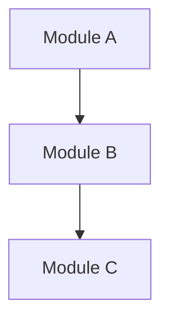
```

**File placement by agent:**
| Agent | Output file | Diagram purpose |
|-------|-------------|-----------------|
| nr-mapper | `.planning/codebase/ARCHITECTURE.md` | Layer architecture, component hierarchy |
| nr-planner | `.planning/phase-N/PLAN.md` | Task dependency graph, wave structure |
| nr-verifier | `.planning/phase-N/VERIFICATION.md` | Criterion pass/fail distribution |
| nr-debugger | `.planning/debug/[issue].md` | Hypothesis tree, data flow trace |
| nr-roadmapper | `.planning/ROADMAP.md` | Phase sequence with gates |
| nr-researcher | `.planning/phase-N/RESEARCH.md` | Architecture comparisons, pipeline recommendations |
| nr-executor | `.planning/phase-N/SUMMARY.md` | Artifact dependency graph |
| nr-quant-auditor | `.planning/audit/REPORT.md` | Contamination propagation map |

### Python Plot Scripts

**Location:** `.planning/plots/` (general) or `.planning/strategy/plots/` (quant).

**Naming:** `[phase]-[description].py` — e.g., `p3-feature-ic-distribution.py`, `p6-equity-curve.py`

**Template:**
```python
"""
Generated by Netrunner — Phase [N]: [description]
Run: python .planning/plots/[filename].py
"""
import matplotlib.pyplot as plt
import pandas as pd
import numpy as np

# --- Data loading ---
# [agent fills in project-specific data loading]

# --- Plot ---
fig, ax = plt.subplots(figsize=(12, 6))
# [agent fills in plot logic]

ax.set_xlabel('[X label]')
ax.set_ylabel('[Y label]')
ax.set_title('[Descriptive title]')
ax.legend()
plt.tight_layout()
plt.savefig('.planning/plots/[filename].png', dpi=150)
plt.close()
print(f"Saved: .planning/plots/[filename].png")
```

**Standards (non-negotiable):**
- Every axis labeled
- Every plot has a title
- Legend when multiple series
- `tight_layout()` always
- Save to `.planning/plots/` with `dpi=150`
- Print the save path
- Close the figure (`plt.close()`)

## Mermaid Diagram Templates

### Architecture (nr-mapper, nr-researcher)

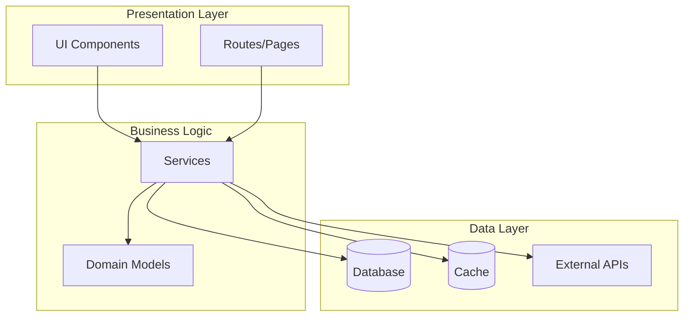

Adapt layers to detected architecture. Use `subgraph` for grouping. Color-code with `style` for risk areas.

### Task Dependency Graph (nr-planner)

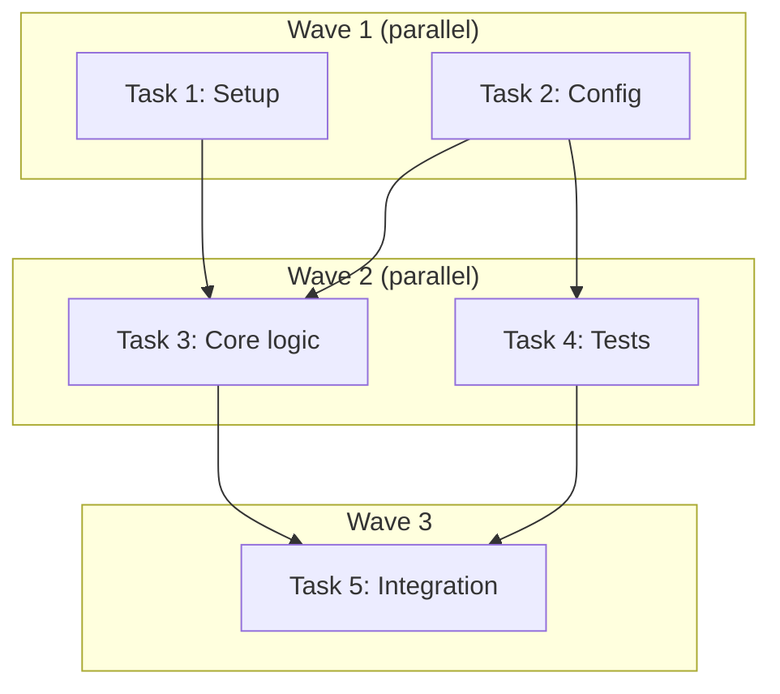

Group tasks by wave. Show dependency edges. Mark critical path tasks with `:::critical` class.

### Phase Sequence (nr-roadmapper)

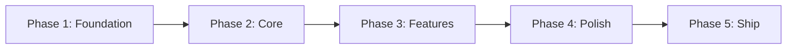

For quant projects, add gate nodes:

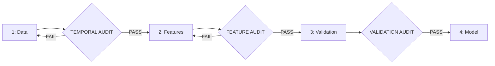

### Verification Results (nr-verifier)

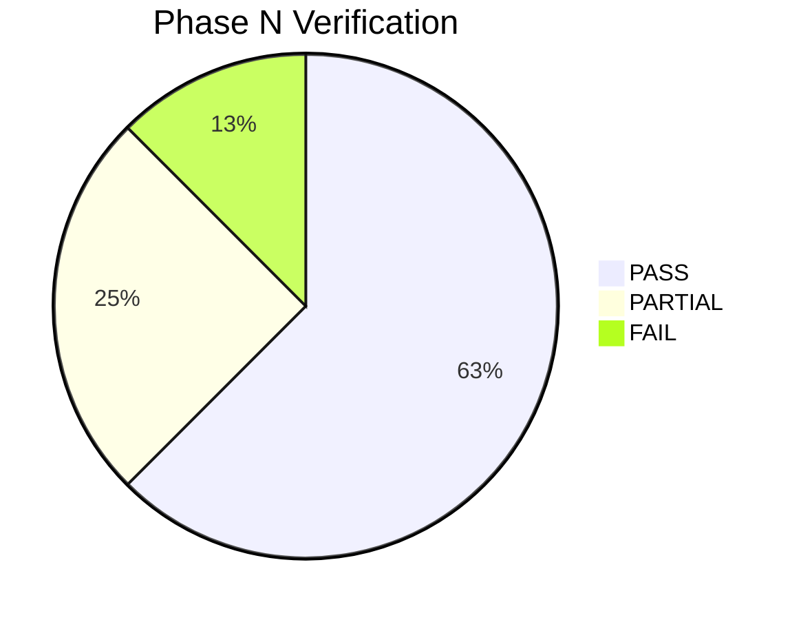

Or for detailed criterion mapping:

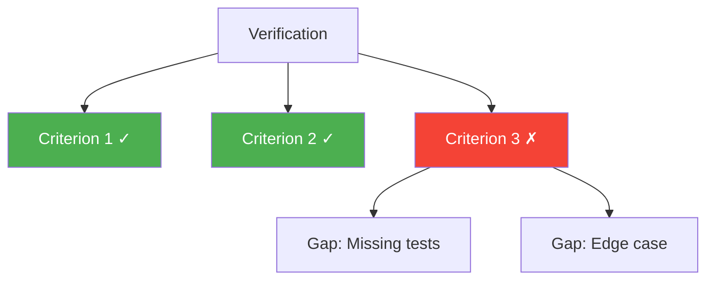

### Hypothesis Tree (nr-debugger)

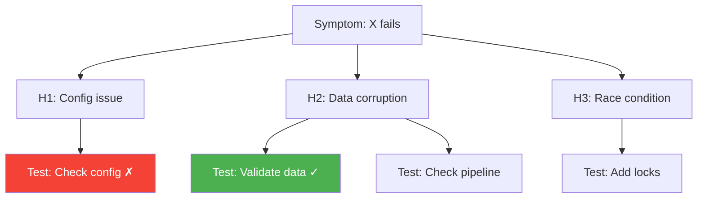

Mark tested hypotheses as confirmed (green) or rejected (red). Untested = default.

### Feature Pipeline (quant — nr-mapper, nr-executor)

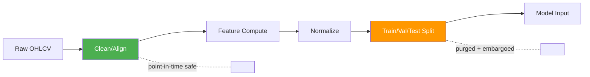

Color-code temporal safety: green = verified safe, orange = requires audit, red = contamination detected.

### Contamination Map (nr-quant-auditor)

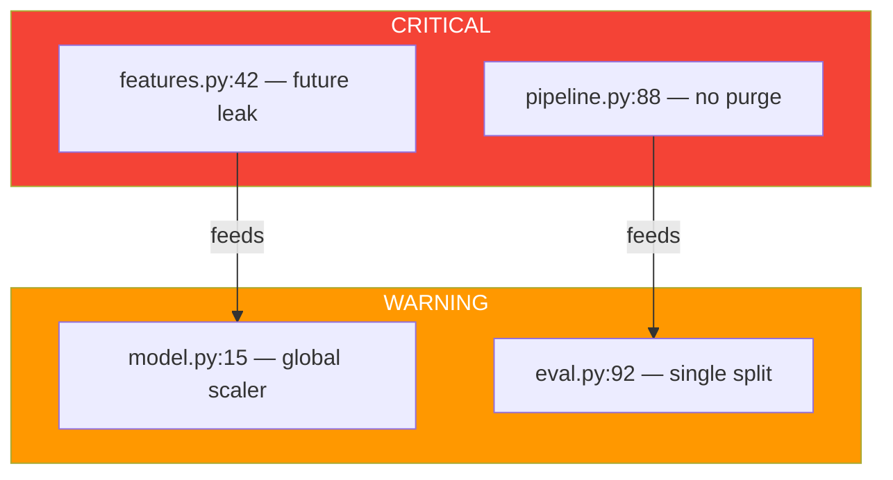

### Component Tree (web — nr-mapper)

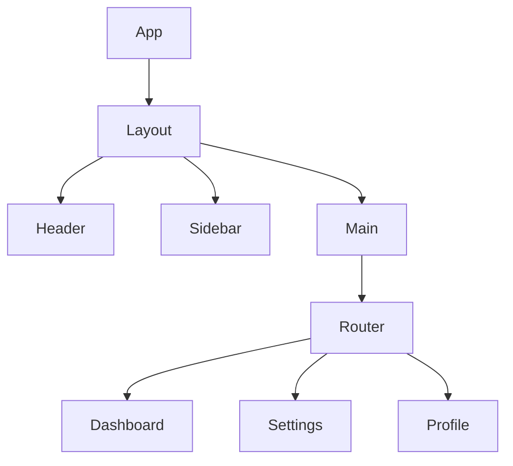

### Data Pipeline DAG (data engineering — nr-mapper)

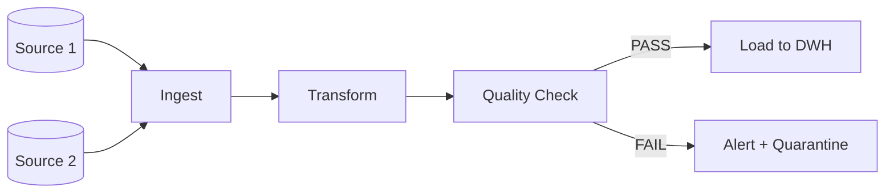

## Python Plot Templates

### Metric Over Time (quant evaluation)

```python
fig, axes = plt.subplots(2, 2, figsize=(16, 10))

# Equity curve
axes[0,0].plot(dates, cumulative_returns)
axes[0,0].set_title('Equity Curve')
axes[0,0].set_ylabel('Cumulative Return')

# Drawdown
axes[0,1].fill_between(dates, drawdown, 0, alpha=0.3, color='red')
axes[0,1].set_title('Drawdown')
axes[0,1].set_ylabel('Drawdown %')

# Rolling Sharpe
axes[1,0].plot(dates, rolling_sharpe)
axes[1,0].axhline(y=0, color='gray', linestyle='--')
axes[1,0].set_title('Rolling Sharpe (252d)')
axes[1,0].set_ylabel('Sharpe Ratio')

# Returns distribution
axes[1,1].hist(daily_returns, bins=50, alpha=0.7)
axes[1,1].set_title('Returns Distribution')
axes[1,1].set_xlabel('Daily Return')
```

### Feature Analysis (quant features)

```python
fig, axes = plt.subplots(1, 3, figsize=(18, 5))

# IC distribution
axes[0].hist(ic_values, bins=30)
axes[0].set_title('Information Coefficient Distribution')

# IC over time
axes[1].plot(dates, rolling_ic)
axes[1].axhline(y=0, color='gray', linestyle='--')
axes[1].set_title('Rolling IC (21d)')

# Feature importance
axes[2].barh(feature_names[:15], importance[:15])
axes[2].set_title('Top 15 Feature Importance')
```

### Verification Dashboard

```python
fig, ax = plt.subplots(figsize=(10, 6))
criteria = ['Tests', 'Coverage', 'Perf', 'Security', 'Docs']
scores = [0.9, 0.85, 0.7, 1.0, 0.6]
colors = ['#4caf50' if s >= 0.8 else '#ff9800' if s >= 0.6 else '#f44336' for s in scores]
ax.barh(criteria, scores, color=colors)
ax.set_xlim(0, 1)
ax.set_title('Phase N Verification Scores')
ax.axvline(x=0.8, color='gray', linestyle='--', label='Target')
ax.legend()
```

## Integration Protocol

Every agent that generates visualizations must:

1. **Generate proactively** — don't wait for user request. If the data exists to visualize, generate the diagram.
2. **Embed in context** — Mermaid goes in the markdown file it describes, not a separate file.
3. **Track in SUMMARY.md** — Add a `## Visualizations` section listing all generated diagrams and plot scripts.
4. **Reference this file** — Load `references/visualization-patterns.md` when generating visualizations for correct templates and conventions.
5. **Adapt templates** — The templates above are starting points. Modify structure, labels, and styling to match the actual project.
