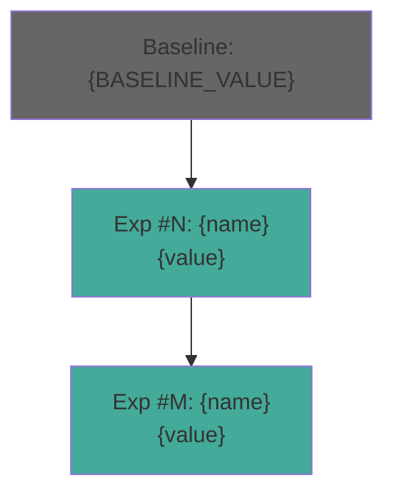

# Workflow: Auto-Research

<purpose>
Autonomous experiment loop inspired by Karpathy's autoresearch. Instead of Netrunner's
standard phase-based cycle (scope→plan→execute→verify), this runs a tight modify→run→eval→decide
loop — producing 20-100+ experiments per session with zero human input between iterations.

The brain (CONTEXT.md) drives proposals. Unlike Karpathy's stateless loop (re-reads program.md
each time), Netrunner accumulates diagnostic state — detecting exhausted clusters, shifting
strategy mid-run, and ranking proposals by information gain.

Core loop: LOAD DIRECTIVE → [PROPOSE → MODIFY → RUN EVAL → DECIDE → LOG]* → REPORT
</purpose>

<inputs>
- Research directive: `.planning/auto-research/DIRECTIVE.md` (or inline from user)
- Eval command: a shell command that runs fast and prints a single number
- Mutable scope: which files/functions the agent can modify
- Immutable scope: which files must NOT be touched
- `.planning/CONTEXT.md` — project context (optional, created if missing)
- Time budget (optional): from extended session mode or explicit flag
</inputs>

<prerequisites>
- At least one mutable file exists in the project
- Eval command runs successfully and produces a parseable numeric result
- Git repository initialized (for checkpointing)
</prerequisites>

<key_differences_from_standard_nr>

| Aspect | Standard NR | Auto-Research |
|--------|------------|---------------|
| Granularity | Phase (hours) | Experiment (minutes) |
| Planning | Full PLAN.md per phase | One-line hypothesis per experiment |
| Execution | Agent spawns, wave dispatch | Direct inline modification |
| Verification | nr-verifier with full report | Single eval metric comparison |
| Failure handling | Remediation cycle | Instant git revert |
| Brain updates | Per phase transition | Per experiment (compact) |
| Output | SUMMARY.md + VERIFICATION.md | Experiment journal |

</key_differences_from_standard_nr>

<procedure>

## Step 1: Initialize

### 1a. Load or create research directive

Check for `.planning/auto-research/DIRECTIVE.md`:
- **Exists** → load it
- **Missing** → create from user prompt using `templates/research-directive.md`

Extract from directive:
```
GOAL:         [what to optimize]
EVAL_CMD:     [shell command — must print a single number]
EVAL_METRIC:  [metric name]
EVAL_DIR:     [lower_is_better | higher_is_better]
MUTABLE:      [file paths or glob patterns the agent CAN modify]
IMMUTABLE:    [file paths or glob patterns that MUST NOT change]
TIME_BUDGET:  [minutes per experiment, default: 5]
MAX_EXPERIMENTS: [cap, default: 50 for standard, 500 for extended]
DOMAIN:       [detected or specified domain]
```

### 1b. Validate eval harness

Run the eval command once to establish baseline:
```bash
BASELINE=$(eval "$EVAL_CMD" 2>/dev/null | tail -1 | grep -oE '[0-9]+\.?[0-9]*' | head -1)
```

**Validation checks:**
- Command exits with code 0
- Output contains a parseable number
- Execution completes within TIME_BUDGET
- Result is deterministic (run twice, compare — if >5% variance, warn about stochastic eval)

If validation fails: HALT with specific error. Do not proceed with a broken eval harness.

Store baseline:
```
BASELINE_VALUE = [number]
BASELINE_COMMIT = $(git rev-parse HEAD)
BEST_VALUE = BASELINE_VALUE
BEST_COMMIT = BASELINE_COMMIT
```

### 1c. Git checkpoint

Ensure clean working tree:
```bash
git add -A && git commit -m "auto-research: baseline checkpoint (${EVAL_METRIC}=${BASELINE_VALUE})" --allow-empty
```

### 1d. Load brain state

If `.planning/CONTEXT.md` exists:
- Extract constraints, closed paths, tried approaches
- Use accumulated knowledge to seed initial proposals

If `.planning/auto-research/JOURNAL.md` exists (resuming a prior session):
- Load experiment history
- Resume from where we left off
- Skip approaches already tried

### 1e. Display initialization banner

```
━━━━━━━━━━━━━━━━━━━━━━━━━━━━━━━━━━━━━━━━━━━━━━━━━━━━━
 NR ► AUTO-RESEARCH
━━━━━━━━━━━━━━━━━━━━━━━━━━━━━━━━━━━━━━━━━━━━━━━━━━━━━

 Goal:     [from directive]
 Metric:   [EVAL_METRIC] ([EVAL_DIR])
 Baseline: [BASELINE_VALUE]
 Mutable:  [file list]
 Budget:   [TIME_BUDGET] min/experiment, [MAX_EXPERIMENTS] max
 Session:  [STANDARD | EXTENDED (ends ~HH:MM)]

━━━━━━━━━━━━━━━━━━━━━━━━━━━━━━━━━━━━━━━━━━━━━━━━━━━━━
```

## Step 2: Experiment Loop

```
EXPERIMENT_COUNT = 0
IMPROVEMENTS = 0
STREAK_WITHOUT_IMPROVEMENT = 0
STRATEGY_SHIFT_THRESHOLD = 10  # consecutive failures before strategy shift

LOOP:
  if EXPERIMENT_COUNT >= MAX_EXPERIMENTS: → Step 3 (Report)
  if extended session and time > SESSION_END_TIME: → Step 3 (Report)
  if STREAK_WITHOUT_IMPROVEMENT >= STRATEGY_SHIFT_THRESHOLD: → Strategy Shift (Step 2e)

  Step 2a: Propose
  Step 2b: Modify
  Step 2c: Run Eval
  Step 2d: Decide
  Step 2e: Log
  EXPERIMENT_COUNT += 1
```

### Step 2a: Propose Experiment

**Brain-driven proposal generation.** This is where Netrunner's brain gives the auto-research
loop intelligence that Karpathy's stateless loop lacks.

**Proposal process:**

1. **Load current state:**
   - Read the mutable file(s) current content
   - Read the research directive (DIRECTIVE.md)
   - Read experiment journal so far (last 10 entries for context window efficiency)

2. **Apply pre-generation gates (from brain):**
   - Constraint check: does proposal violate any hard constraint?
   - Closed path check: does proposal repeat a high-confidence failure?
   - Exhausted cluster check: does proposal fall in an exhausted experiment cluster?
   - Information gain ranking: which experiment resolves the most uncertainty?

3. **Generate proposal:**
   ```
   EXPERIMENT: [short name]
   HYPOTHESIS: [one sentence — why this modification should improve the metric]
   MODIFICATION: [what to change, specifically]
   EXPECTED_IMPACT: [estimated magnitude and direction]
   RISK: [what could go wrong]
   CATEGORY: [hyperparameter | architecture | data | optimization | regularization | other]
   ```

4. **Strategy-aware proposal selection:**

   Track experiment categories in the journal. When a category accumulates 3+ failures
   without improvement → mark as EXHAUSTED. Shift proposals to unexplored categories.

   **Category priority (default, adjustable via directive):**
   ```
   PRIORITY_ORDER = [
     "hyperparameter",     # Quick wins, low risk
     "optimization",       # Training dynamics
     "regularization",     # Overfitting control
     "architecture",       # Structural changes
     "data",               # Data handling changes
     "combination"         # Combine successful modifications
   ]
   ```

   After accumulating 5+ successful experiments, activate **combination proposals** —
   merge 2-3 improvements that passed individually to test interaction effects.

### Step 2b: Modify Code

1. **Git checkpoint before modification:**
   ```bash
   git stash push -m "auto-research: pre-experiment-${EXPERIMENT_COUNT}"
   ```
   (Only if working tree is dirty from previous failed revert.)

2. **Apply the proposed modification:**
   - Read the mutable file(s)
   - Apply the change using Edit tool (preferred) or Write tool (for larger rewrites)
   - Only modify files within MUTABLE scope
   - **NEVER modify files in IMMUTABLE scope** — this is a HARD CONSTRAINT

3. **Syntax validation:**
   - For Python: `python -c "import ast; ast.parse(open('file').read())"`
   - For JavaScript/TypeScript: `node --check file.js` or `npx tsc --noEmit`
   - For other languages: appropriate syntax check

   If syntax check fails: revert immediately, log as "SYNTAX_ERROR", propose next experiment.

4. **Scope validation:**
   Verify no files outside MUTABLE scope were modified:
   ```bash
   git diff --name-only | while read f; do
     # Check f is within MUTABLE scope
   done
   ```

### Step 2c: Run Eval

1. **Execute eval command with timeout:**
   ```bash
   timeout ${TIME_BUDGET}m $EVAL_CMD 2>&1
   ```

2. **Parse result:**
   ```
   EVAL_RESULT = [parsed number from output]
   EVAL_EXIT_CODE = $?
   EVAL_DURATION = [seconds elapsed]
   ```

3. **Handle eval failures:**
   - Exit code non-zero → log as "EVAL_FAILED", revert, continue
   - Timeout → log as "EVAL_TIMEOUT", revert, continue
   - No parseable number → log as "EVAL_PARSE_ERROR", revert, continue
   - Result is NaN or Inf → log as "EVAL_INVALID", revert, continue

### Step 2d: Decide — Keep or Revert

**Improvement check:**
```
if EVAL_DIR == "lower_is_better":
    IMPROVED = (EVAL_RESULT < BEST_VALUE)
elif EVAL_DIR == "higher_is_better":
    IMPROVED = (EVAL_RESULT > BEST_VALUE)
```

**If IMPROVED:**
```bash
git add -A
git commit -m "auto-research: experiment #${EXPERIMENT_COUNT} — ${EXPERIMENT_NAME} (${EVAL_METRIC}: ${BEST_VALUE} → ${EVAL_RESULT})"
BEST_VALUE = EVAL_RESULT
BEST_COMMIT = $(git rev-parse HEAD)
IMPROVEMENTS += 1
STREAK_WITHOUT_IMPROVEMENT = 0
```

Display:
```
 ✓ Experiment #[N]: [name] — [metric]: [old] → [new] ([improvement%])
```

**If NOT IMPROVED:**
```bash
git checkout -- .  # Revert all changes
git clean -fd      # Remove any new files
STREAK_WITHOUT_IMPROVEMENT += 1
```

Display:
```
 ✗ Experiment #[N]: [name] — [metric]: [result] (no improvement)
```

**If WITHIN NOISE (within 1% of best for stochastic evals):**
Log as "NOISE" — neither keep nor count as failure streak. Revert the change.

### Step 2e: Log to Experiment Journal

Append to `.planning/auto-research/JOURNAL.md`:

```markdown
| # | Experiment | Category | Hypothesis | Result | Baseline | Best | Verdict | Duration |
|---|-----------|----------|------------|--------|----------|------|---------|----------|
| [N] | [name] | [cat] | [1-line hypothesis] | [value] | [baseline] | [best] | [IMPROVED/NO_CHANGE/FAILED/REVERTED] | [Ns] |
```

**Brain write-back (compact, every 5 experiments):**
```bash
node ~/.claude/netrunner/bin/nr-tools.cjs brain add-tried \
  "auto-research batch [N-4]-[N]: [summary of last 5]" --cwd .
```

**Cluster tracking:**
Update category statistics:
```
CATEGORY_STATS[category].attempts += 1
if IMPROVED:
    CATEGORY_STATS[category].successes += 1
if CATEGORY_STATS[category].attempts >= 3 and CATEGORY_STATS[category].successes == 0:
    CATEGORY_STATS[category].status = "EXHAUSTED"
```

### Step 2f: Strategy Shift (when STREAK_WITHOUT_IMPROVEMENT >= threshold)

When too many consecutive experiments fail:

1. **Analyze the journal** — which categories have been exhausted?
2. **Brain reasoning step:**
   - "Given [N] consecutive failures across categories [X, Y, Z], the current
     approach space appears depleted. Possible shifts:"
   - Increase modification scope (larger changes)
   - Try combination experiments (merge past successes)
   - Shift to unexplored categories
   - Revise the research directive hypothesis
3. **Log the strategy shift** to journal and CONTEXT.md
4. **Reset streak counter** after shift
5. **If ALL categories exhausted:** proceed to Step 3 (Report) — further experiments unlikely to help

## Step 3: Report

### 3a. Generate experiment report

Write `.planning/auto-research/REPORT.md`:

```markdown
# Auto-Research Report

## Summary
- **Goal:** [from directive]
- **Experiments run:** [EXPERIMENT_COUNT]
- **Improvements found:** [IMPROVEMENTS]
- **Baseline:** [BASELINE_VALUE]
- **Best achieved:** [BEST_VALUE] ([improvement%] improvement)
- **Best commit:** [BEST_COMMIT]
- **Duration:** [total elapsed time]
- **Strategy shifts:** [count]

## Improvement Timeline

| # | Experiment | Improvement | Cumulative |
|---|-----------|-------------|------------|
| [N] | [name] | [delta] | [cumulative improvement from baseline] |

## Category Analysis

| Category | Attempts | Successes | Status |
|----------|----------|-----------|--------|
| [cat] | [N] | [N] | [ACTIVE/EXHAUSTED] |

## Top Discoveries

[List the top 3-5 improvements with their hypotheses and magnitudes]

## Exhausted Approaches

[Categories/approaches that were explored but yielded no improvement]

## Recommendations

[What to try next if the user wants to continue — based on brain analysis
of which approaches haven't been explored yet]
```

### 3b. Generate Mermaid improvement chart



### 3c. Brain write-back (final)

```bash
node ~/.claude/netrunner/bin/nr-tools.cjs brain add-tried \
  "Auto-research session: ${EXPERIMENT_COUNT} experiments, ${IMPROVEMENTS} improvements, ${EVAL_METRIC}: ${BASELINE_VALUE} → ${BEST_VALUE}" --cwd .
node ~/.claude/netrunner/bin/nr-tools.cjs brain update-hypothesis \
  "Auto-research complete — [summary of what was learned]" --cwd .
```

### 3d. Display completion banner

```
━━━━━━━━━━━━━━━━━━━━━━━━━━━━━━━━━━━━━━━━━━━━━━━━━━━━━
 NR ► AUTO-RESEARCH COMPLETE
━━━━━━━━━━━━━━━━━━━━━━━━━━━━━━━━━━━━━━━━━━━━━━━━━━━━━

 Experiments:  [N] run, [M] improved
 Metric:      [EVAL_METRIC]: [BASELINE] → [BEST] ([%] improvement)
 Duration:    [elapsed]
 Best commit: [hash]

 Top improvements:
   1. [name] — [delta]
   2. [name] — [delta]
   3. [name] — [delta]

 Report: .planning/auto-research/REPORT.md
 Journal: .planning/auto-research/JOURNAL.md

━━━━━━━━━━━━━━━━━━━━━━━━━━━━━━━━━━━━━━━━━━━━━━━━━━━━━
```

</procedure>

<domain_specific_behavior>

## Domain-Specific Experiment Strategies

### Quantitative Finance / Trading

When quant domain is detected (via CONTEXT.md or directive signals):

**Additional constraints:**
- NEVER introduce lookahead bias in modifications — temporal contamination is a HARD CONSTRAINT
- Every feature modification must preserve point-in-time correctness
- Eval metric should include transaction costs if evaluating P&L
- Load `references/quant-code-patterns.md` for anti-pattern avoidance

**Preferred experiment categories:**
1. Feature engineering (new features, transformations, normalization)
2. Model hyperparameters (learning rate, regularization, architecture params)
3. Training dynamics (batch size, learning rate schedule, loss function)
4. Data handling (lookback windows, resampling, filtering)

**Forbidden modifications:**
- Shuffling time-series data
- Using future data in feature computation
- Fitting scalers/normalizers on full dataset

### ML / Data Science

**Preferred experiment categories:**
1. Hyperparameter tuning (learning rate, batch size, dropout)
2. Architecture modifications (layer sizes, activation functions, skip connections)
3. Training improvements (optimizer, schedule, augmentation)
4. Regularization (dropout, weight decay, early stopping criteria)

### Web Development

**Preferred experiment categories:**
1. Bundle optimization (code splitting, tree shaking, lazy loading)
2. Rendering performance (memoization, virtualization, SSR tuning)
3. Asset optimization (image formats, compression, caching headers)
4. CSS performance (critical CSS, selector optimization)

### General (any domain)

Default categories apply. The brain adapts proposal strategy based on
which categories produce improvements in this specific project.

</domain_specific_behavior>

<edge_cases>

## Edge Cases

### Stochastic eval metrics
- If baseline validation (Step 1b) detects >5% variance between two runs:
  - Warn user: "Eval metric has high variance — results may be noisy"
  - Run eval 3 times per experiment and use median
  - Increase improvement threshold from 0% to 2% (noise floor)

### Eval takes too long
- If single eval exceeds TIME_BUDGET:
  - Warn user: "Eval exceeds time budget — consider reducing dataset or simplifying eval"
  - Auto-adjust TIME_BUDGET to 2x observed duration
  - Reduce MAX_EXPERIMENTS proportionally to stay within session time

### Mutable file is large
- If mutable files exceed 1000 lines total:
  - Focus modifications on specific functions/sections, not whole-file rewrites
  - Use Edit tool exclusively (not Write) to minimize change scope
  - Consider asking user to narrow MUTABLE scope

### No improvement after MAX_EXPERIMENTS
- This is not a failure — it's a finding
- Report: "Baseline appears near-optimal within the explored modification space"
- Recommend: "Consider expanding mutable scope or changing the eval metric"

### Eval metric goes to unexpected value (NaN, Inf, negative when expecting positive)
- Immediately revert
- Log the exact modification that caused it
- Add the modification pattern to CONTEXT.md as a closed path
- Continue with next experiment

### Git conflicts during revert
- Use `git checkout -- .` + `git clean -fd` (not `git stash pop`)
- If still dirty: `git reset --hard HEAD` as last resort
- Log the conflict for debugging

### Resuming a prior auto-research session
- Check `.planning/auto-research/JOURNAL.md` for experiment history
- Load BEST_VALUE and BEST_COMMIT from journal
- Skip proposals that match already-tried experiments
- Continue EXPERIMENT_COUNT from where we left off

</edge_cases>

<success_criteria>
- Eval harness validates before first experiment (exits 0, produces number, within time budget)
- Every experiment is git-checkpointed (baseline + each improvement committed)
- Failed experiments are cleanly reverted — no dirty state leaks between experiments
- Brain accumulates knowledge — later proposals avoid exhausted clusters
- Strategy shifts when consecutive failures exceed threshold
- Final report includes: experiment count, improvements found, category analysis, recommendations
- Domain-specific constraints enforced (temporal safety for quant, etc.)
- Extended session mode: graceful wind-down when time expires
- Journal is complete and machine-parseable for analysis
</success_criteria>
