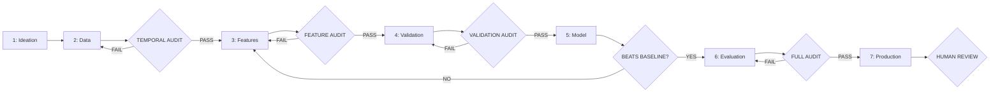
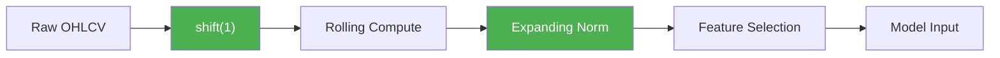
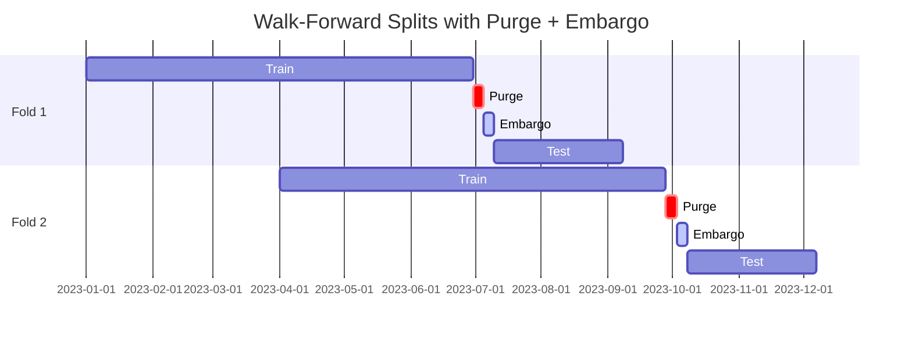
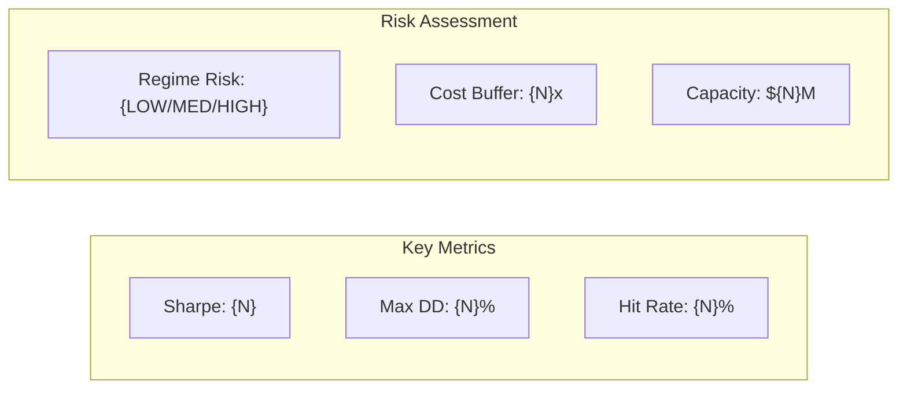

# Workflow: Build Strategy

<purpose>
End-to-end quantitative trading strategy building from idea to production readiness.
7 mandatory phases in strict order. Each phase has a quant-auditor gate that must pass before proceeding.
This is the gold standard workflow — no shortcuts, no skipped phases.
</purpose>

<inputs>
- Strategy idea/thesis from user (via run.md BUILD_STRATEGY classification)
- `.planning/CONTEXT.md` — project context, constraints, prior work
- Asset class, frequency, target holding period
- **Research corpus** (if exists) — `research/` directory with synthesis and individual docs
</inputs>

<prerequisites>
- Quant persona must be active (2+ detection signals in CONTEXT.md)
- References loaded: quant-finance.md, strategy-metrics.md, feature-engineering.md, ml-training.md, quant-code-patterns.md, research-integration.md, academic-research-protocol.md, production-reality.md, overfitting-diagnostics.md, backtest-audit-pipeline.md, live-drift-detection.md, alpha-decay-patterns.md, risk-management-framework.md, production-failure-case-studies.md
</prerequisites>

<research_corpus_protocol>

## Research Corpus Integration

**Before starting Phase 1**, check for an existing research corpus:

1. **Scan** for `research/` directory in project root (also `.planning/research/`, `docs/research/`)
2. **If found** with synthesis file (`00_SYNTHESIS.md` or similar):
   - Load synthesis FULLY — this IS the senior quant's complete analysis
   - The synthesis replaces most of Phase 1 (Ideation & Research)
   - Set `RESEARCH_CORPUS = true`

**When `RESEARCH_CORPUS = true`, the entire workflow shifts:**

| Phase | Without Research | With Research Corpus |
|-------|-----------------|---------------------|
| 1. Ideation | Spawn 3 researchers, web search, build thesis from scratch | Extract thesis from synthesis. Skip researcher spawns. Write THESIS.md from synthesis findings. Only research truly novel gaps. |
| 2. Data | Generic data pipeline planning | Use synthesis data acquisition guide (exact sources, endpoints, free data locations). Reference specific docs. |
| 3. Features | Research feature approaches from web | Use synthesis feature recommendations (exact feature names, parameters, expected ICs). Load specific docs for implementation details. |
| 4. Validation | Generic walk-forward setup | Use synthesis validation framework recommendations (specific split sizes, purge gaps, metrics). |
| 5. Model | Explore architectures from literature | Follow synthesis complexity ladder and architecture recommendations. Use research-specified hyperparameters. |
| 6. Evaluation | Standard evaluation suite | Use synthesis key numbers as comparison baselines. Apply research-specified reality checks (DSR, cost sensitivity). |
| 7. Production | Generic production setup | Follow synthesis deployment timeline and risk framework. Use research-specified kill switch values. |

**Research-informed constraint frame (added to every phase):**
```
RESEARCH CORPUS ACTIVE:
- Synthesis: [path to synthesis file]
- Relevant docs this phase: [Doc N, Doc M, ...]
- Research closed paths: [list from synthesis "Closed Paths" section]
- Research key numbers: [relevant metrics from synthesis]
- Expected impact: [from synthesis, labeled UNVALIDATED]
- Specific parameters: [exact values from research docs]
```

**Research closed paths are HARD CONSTRAINTS across ALL phases:**
The synthesis's "Closed Paths" section lists confirmed dead ends that were established through rigorous analysis. These MUST be treated with the same severity as CONTEXT.md hard constraints. Never plan, implement, or suggest approaches that fall within these closed paths.

</research_corpus_protocol>

<phase_enforcement>

## Phase Order (NON-NEGOTIABLE)

```
PHASE_ORDER = [
    "IDEATION",       # Phase 1: Research and thesis formation
    "DATA",           # Phase 2: Data infrastructure and temporal safety
    "FEATURES",       # Phase 3: Feature engineering with temporal guarantees
    "VALIDATION",     # Phase 4: Walk-forward validation framework
    "MODEL",          # Phase 5: Model development and baseline comparison
    "EVALUATION",     # Phase 6: Full strategy evaluation suite
    "PRODUCTION"      # Phase 7: Production readiness and human review
]

# NON-NEGOTIABLE: phases cannot be skipped or reordered.
# The ONLY exception: going BACKWARD (e.g., from MODEL back to FEATURES).
# Forward skipping is NEVER allowed.
```

**Generate phase flow diagram** at strategy initialization — write to `.planning/strategy/PIPELINE.md`:



### Skip Prevention Logic

Before entering any phase N, verify:
1. All phases 1 through N-1 have status COMPLETE in STATE.md
2. All gates for phases 1 through N-1 have PASS status
3. No CRITICAL violations remain unresolved from prior audits

If any check fails, HALT and report which prerequisite is missing.

</phase_enforcement>

<procedure>

---

## Phase 1: IDEATION & RESEARCH

**Goal:** Define what market inefficiency you are exploiting and why it should persist.

### 1.0 Research Corpus Check (BEFORE any research)

**Check for existing research corpus FIRST:**

1. Scan for `research/` directory in project root
2. If found with synthesis file:

**`RESEARCH_CORPUS = true` → FAST PATH (skip most of Phase 1):**

The research corpus IS the ideation and research phase — it was done by a senior quant researcher. Extract rather than re-research:

**1.0a Extract thesis from synthesis:**
Read the synthesis's "Executive Summary" and "What We Know" sections. Write `.planning/strategy/THESIS.md` by extracting:
- Edge hypothesis → from synthesis's core findings
- Edge source classification → from synthesis's characterization of the alpha source
- Falsification criteria → from synthesis's key uncertainties and open questions

**1.0b Extract research from corpus:**
Write `.planning/strategy/RESEARCH.md` by synthesizing the corpus:
- Academic foundations → cite specific doc numbers with findings
- Practitioner insights → extract from relevant docs
- Decay patterns → from synthesis's decay/risk analysis
- Closed paths → from synthesis's "Closed Paths" section (these become HARD CONSTRAINTS)
- Key numbers → from synthesis's metrics table

**1.0c Extract strategy profile:**
Write `.planning/strategy/PROFILE.md` from synthesis's strategy characterization.

**1.0d Gap analysis:**
Compare synthesis coverage against Phase 1 requirements. If gaps exist (unlikely for a thorough corpus), spawn a SINGLE researcher for gap-fill only:
```
Task(subagent_type="nr-researcher", description="Gap-fill research",
  prompt="Existing research corpus has [N] docs covering [topics].
  GAPS to fill: [specific gaps not covered by existing research].
  Do NOT re-research covered topics. Cite existing docs where possible.
  Write gap findings to .planning/strategy/RESEARCH-GAPS.md")
```

**Skip to 1.4 (Strategy Profile) after corpus extraction.** Do NOT spawn the 3-researcher team below — the senior quant already did that work.

---

**`RESEARCH_CORPUS = false` → STANDARD PATH (full Phase 1):**

### 1.1 Edge Hypothesis Definition

The strategy MUST begin with a written thesis answering:
- **What inefficiency exists?** (e.g., momentum persistence, mean reversion at microstructure level)
- **Why does it exist?** (behavioral bias, structural constraint, information asymmetry)
- **Why hasn't it been arbitraged away?** (capacity limits, execution difficulty, data access)
- **What would falsify this thesis?** (specific metrics or conditions that disprove the edge)

If the user cannot articulate the edge, STOP. No amount of ML sophistication compensates for a missing edge.

### 1.2 Edge Source Classification

Classify the strategy's edge into one or more categories:

| Edge Source | Description | Typical Decay | Example |
|-------------|-------------|---------------|---------|
| **Speed** | Faster execution or data processing | Days to weeks | HFT, latency arbitrage |
| **Information** | Access to unique or alternative data | Months | Satellite imagery, NLP sentiment |
| **Modeling** | Superior signal extraction from public data | Weeks to months | ML alpha, factor timing |
| **Structural** | Exploiting market structure constraints | Years | Index rebalancing, regulatory effects |

### 1.3 Literature Research (Team-Based Parallel)

Spawn 3 researcher agents concurrently for comprehensive review:

**Create research team:**
```
TeamCreate(team_name="nr-research-strategy", description="Parallel strategy research — 3 focus areas")
```

**Create research tasks:**
```
TaskCreate(subject="Research: academic literature",
  description="Find academic papers on this edge type (last 10 years), theoretical foundations, and known decay patterns. Write to .planning/strategy/RESEARCH-ACADEMIC.md.",
  activeForm="Researching academic literature")

TaskCreate(subject="Research: practitioner insights",
  description="Find practitioner reports, fund letters, and real-world implementation examples for this strategy class. Estimate capacity from literature. Write to .planning/strategy/RESEARCH-PRACTITIONER.md.",
  activeForm="Researching practitioner insights")

TaskCreate(subject="Research: decay and pitfalls",
  description="Research common pitfalls specific to this strategy class, signal decay patterns, and historical failure modes. Write to .planning/strategy/RESEARCH-DECAY.md.",
  activeForm="Researching decay patterns")
```

**Spawn 3 researchers (ONE turn for concurrency):**
```
Agent(team_name="nr-research-strategy", name="researcher-academic", subagent_type="nr-researcher",
  prompt="You are a team member on nr-research-strategy. Check TaskList, claim 'Research: academic literature'.

  Strategy thesis: [user's strategy description]
  Asset class: [asset class]
  Frequency: [frequency]

  MANDATORY: Follow the Academic Research Protocol from references/academic-research-protocol.md.

  Search procedure:
  1. arXiv q-fin: site:arxiv.org q-fin [strategy type] [asset class]
  2. SSRN: site:ssrn.com [strategy type] quantitative trading
  3. Google Scholar: [strategy type] [asset class] out-of-sample [current year - 2]

  For each paper found, evaluate through Tier 1-4 framework:
  - Tier 1: Publication quality (A/B/C/D/F)
  - Tier 2: Methodological rigor (OOS test? Transaction costs? Walk-forward?)
  - Tier 3: Practical relevance (asset class match? capacity? execution assumptions?)
  - Tier 4: Overfitting red flags (Sharpe > 3? Only IS results? Many variants tested?)

  Check factor decay timelines from references/alpha-decay-patterns.md.
  Flag any strategy based on known-decayed factors.

  Output format:
  ## Academic Literature Review
  ### Key Papers (table with: Paper, Authors, Year, Tier, Key Finding, OOS Performance, Relevance)
  ### Validated Approaches
  ### Dead Ends (published but decayed)
  ### Methodology Recommendations
  ### Hard Constraints from Literature

  Write to: .planning/strategy/RESEARCH-ACADEMIC.md
  Mark task completed when done.")

Agent(team_name="nr-research-strategy", name="researcher-practitioner", subagent_type="nr-researcher",
  prompt="You are a team member on nr-research-strategy. Check TaskList, claim 'Research: practitioner insights'.

  Strategy thesis: [user's strategy description]
  Asset class: [asset class]
  Frequency: [frequency]

  Find:
  1. Practitioner reports and fund letters on this strategy class
  2. Real-world implementation examples and lessons
  3. Estimated capacity from industry sources

  Write to: .planning/strategy/RESEARCH-PRACTITIONER.md
  Mark task completed when done.")

Agent(team_name="nr-research-strategy", name="researcher-decay", subagent_type="nr-researcher",
  prompt="You are a team member on nr-research-strategy. Check TaskList, claim 'Research: decay and pitfalls'.

  Strategy thesis: [user's strategy description]
  Asset class: [asset class]
  Frequency: [frequency]

  Find:
  1. Common pitfalls specific to this strategy class
  2. Signal decay patterns and historical failure modes
  3. Crowding risk and capacity constraints

  Write to: .planning/strategy/RESEARCH-DECAY.md
  Mark task completed when done.")
```

**Merge and cleanup:**
```
# Leader merges 3 research files into unified RESEARCH.md
# Merge: RESEARCH-ACADEMIC.md + RESEARCH-PRACTITIONER.md + RESEARCH-DECAY.md → RESEARCH.md

SendMessage(type="shutdown_request", recipient="researcher-academic")
SendMessage(type="shutdown_request", recipient="researcher-practitioner")
SendMessage(type="shutdown_request", recipient="researcher-decay")
TeamDelete()
```

**Sequential fallback:** If TeamCreate is unavailable or team spawning fails, use a single researcher `Task()` call:
```
Task(
  subagent_type="nr-researcher",
  description="Research strategy thesis and prior art",
  prompt="Research the following strategy thesis:
  Thesis: [user's strategy description]. Asset class: [asset class]. Frequency: [frequency].
  Find: 1) Academic papers (last 10 years), 2) Known decay patterns, 3) Common pitfalls, 4) Estimated capacity.
  Output: .planning/strategy/RESEARCH.md"
)
```

### 1.4 Strategy Profile

Document the strategy profile:

```markdown
## Strategy Profile
- **Asset Class:** [equities, futures, crypto, FX, options, multi-asset]
- **Frequency:** [tick, intraday, daily, weekly]
- **Target Holding Period:** [seconds, minutes, hours, days, weeks]
- **Universe Size:** [number of instruments]
- **Capacity Estimate:** [AUM before alpha decay — from literature]
- **Data Requirements:** [list all data sources needed]
- **Edge Source:** [speed | information | modeling | structural]
- **Expected Sharpe (gross):** [realistic estimate from literature]
```

### 1.5 Outputs

- `.planning/strategy/THESIS.md` — edge hypothesis, falsification criteria
- `.planning/strategy/RESEARCH.md` — literature review, prior art
- `.planning/strategy/PROFILE.md` — strategy profile document

### Gate: NONE

This is the research phase. No automated gate, but the edge hypothesis MUST be written before proceeding. If the thesis document is empty or vague ("ML will find patterns"), the workflow halts.

---

## Phase 2: DATA INFRASTRUCTURE

**Goal:** Build the data pipeline with ironclad temporal safety guarantees.

### 2.0 Research Corpus Data Guidance (if `RESEARCH_CORPUS = true`)

Before planning data infrastructure from scratch, load research guidance:
1. **Scan synthesis** for data-related sections (data acquisition, data sources, data schema)
2. **Load relevant research docs** — look for docs covering: data acquisition, data sources, API endpoints, data formats
3. **Extract specific data guidance:**
   - Exact data sources with URLs/endpoints
   - Free vs paid data availability
   - Data resolution and history depth
   - Known data quality issues
   - Publication delays per data source
4. **Use research-specified sources as the authoritative data plan** — don't re-research what's already known
5. **Only research NEW data sources** not covered by the corpus

Example (from a typical quant research corpus):
```
Research says (Doc 22): "Binance Vision has 5 years of OI, long/short ratios,
taker volume at 5-min resolution. Premium index klines at 1-min, full history. Zero cost."
→ Use these EXACT sources. Don't web-search for alternatives.
```

### 2.1 Data Source Identification

For each data source required by the strategy profile:
- **Source name and provider** (e.g., Yahoo Finance, Binance API, WRDS)
- **Update frequency and latency** (real-time, T+1, T+2)
- **Publication delay** — CRITICAL: when is the data actually available?
  - Earnings: filed days after quarter end
  - Economic indicators: published with delay
  - Price data: typically available at close or next open
- **Survivorship bias risk** — does the dataset exclude delisted/failed instruments?
- **Look-ahead risk assessment** — can any field contain future information?

### 2.2 Data Quality Audit

For each data source, verify:

```python
# Data quality checks — ALL must pass
def audit_data_quality(df):
    checks = {
        "no_future_dates": df.index.max() <= pd.Timestamp.now(),
        "no_duplicate_timestamps": not df.index.duplicated().any(),
        "monotonic_index": df.index.is_monotonic_increasing,
        "missing_rate": df.isnull().mean().max() < 0.05,  # <5% missing per column
        "no_negative_prices": (df[price_cols] > 0).all().all(),
        "no_zero_volume_with_price_change": True,  # custom check
    }
    return checks
```

### 2.3 Temporal Boundary Enforcement

ALL data loading code MUST enforce temporal boundaries:

```python
# CORRECT: Temporal boundary in data loading
def load_data(as_of_date: pd.Timestamp) -> pd.DataFrame:
    """Load data available as of the given date."""
    df = raw_data[raw_data['publication_date'] <= as_of_date]  # point-in-time
    return df

# INCORRECT: Loading all data without temporal filter
def load_data() -> pd.DataFrame:
    return pd.read_csv("all_data.csv")  # NO temporal boundary
```

### 2.4 Missing Data Protocol

Handle missing data with strict rules:
- **Forward fill with limit:** `df.ffill(limit=5)` — never unlimited forward fill
- **NEVER backfill:** `df.bfill()` is BANNED — it uses future data
- **Document every fill:** log which columns, how many values, what limit
- **Prefer dropna over fill** for critical signals — missing IS information

### 2.5 Data Schema Documentation

Write data schema to `.planning/strategy/DATA_SCHEMA.md`:

```markdown
| Column | Type | Source | Pub Delay | Fill Method | Notes |
|--------|------|--------|-----------|-------------|-------|
| close  | float | Exchange | T+0 | None | Adjusted for splits |
| volume | int   | Exchange | T+0 | ffill(1) | |
| earnings | float | SEC | T+2 to T+90 | None | Filing date, not period end |
```

### 2.6 Outputs

- Data loading module with temporal boundaries
- `.planning/strategy/DATA_SCHEMA.md` — complete data dictionary
- Data quality audit report

### Gate: TEMPORAL_AUDIT

```
Task(
  subagent_type="nr-verifier",
  description="Temporal audit of data infrastructure",
  prompt="Run TEMPORAL_AUDIT on all data loading code.

  Load references/quant-code-patterns.md for correct/incorrect patterns.

  Check:
  1. Every data load function has a temporal boundary parameter
  2. No backfill operations anywhere in data code
  3. Publication delays documented for every data source
  4. Forward fill has explicit limits
  5. Survivorship bias addressed

  Scoring:
  - Each CRITICAL violation (lookahead, backfill): -20 points from 100
  - Each WARNING (missing docs, unlimited ffill): -5 points
  - Must score >= 90 to pass

  Write audit: .planning/audit/AUDIT-TEMPORAL-DATA.md
  Return: PASS/FAIL with score"
)
```

**If FAIL:** Fix violations, re-run audit. Max 3 retries.

---

## Phase 3: FEATURE ENGINEERING

**Goal:** Build predictive features with temporal safety and statistical rigor.

### 3.0 Research Corpus Feature Guidance (if `RESEARCH_CORPUS = true`)

Before designing features from scratch, load research guidance:
1. **Scan synthesis** for feature-related tiers/recommendations
2. **Load relevant research docs** — look for docs covering: feature engineering, specific feature types, IC analysis, feature selection
3. **Extract specific feature guidance:**
   - Exact feature names and computation formulas
   - Expected IC ranges per feature
   - Known pitfalls per feature type (e.g., "real VPIN baseline is 0.117, not 0.45")
   - Recommended feature count and selection methodology
   - Feature groups with expected decorrelation properties
4. **Use research-specified features as the implementation plan:**
   - Each feature task references the specific doc: "Implement features from Doc [N]"
   - Use exact parameter values: "N=30 buckets for VPIN", "480x premium basis frequency"
   - Apply research-specified temporal safety rules per feature
5. **Feature selection methodology** — follow research-recommended pipeline if specified

Example (from a typical quant research corpus):
```
Research says (Doc 19): "Compute VPIN directly from kline taker_buy_volume.
BVC is unnecessary. Real baseline is 0.117. N=30 buckets."
→ Implement EXACTLY this. Don't web-search for alternative VPIN methods.
```

### 3.1 Feature Extraction

Follow `references/feature-engineering.md` lifecycle:
1. **Raw → Derived:** Apply transformations (returns, ratios, ranks)
2. **Derived → Features:** Combine with domain logic (momentum, mean reversion signals)
3. **Features → Selected:** Statistical filtering with multiple testing correction

### 3.2 Temporal Safety in Feature Construction

EVERY rolling computation MUST follow the shift-before-roll pattern:

```python
# CORRECT: shift THEN roll — uses only past data
feature = df['close'].shift(1).rolling(window=20).mean()

# INCORRECT: roll THEN shift — window includes current bar
feature = df['close'].rolling(window=20).mean().shift(1)

# CORRECT: expanding window normalization (no future stats)
feature = (df['ret'] - df['ret'].expanding().mean()) / df['ret'].expanding().std()

# INCORRECT: full-sample normalization (uses future data)
feature = (df['ret'] - df['ret'].mean()) / df['ret'].std()
```

### 3.3 Feature Evaluation

Evaluate each feature candidate with:

| Metric | Method | Threshold | Notes |
|--------|--------|-----------|-------|
| **Information Coefficient (IC)** | Rank correlation with forward returns | abs(IC) > 0.02 | Walk-forward, not full sample |
| **IC Decay** | IC at lag 1, 2, 5, 10, 20 | Monotonically decreasing | Validates signal, not noise |
| **Regime Stability** | IC by market regime (bull/bear/sideways) | Positive in 2+ regimes | Single-regime signals are fragile |
| **Turnover** | Feature rank change per period | < 0.5 | High turnover = high transaction costs |
| **Multiple Testing** | Bonferroni or Benjamini-Hochberg FDR | Adjusted p < 0.05 | MANDATORY when testing 10+ features |

### 3.4 Feature Ablation Study

Test feature importance via walk-forward ablation:

```python
# Walk-forward feature ablation — NOT single train/test split
for fold in walk_forward_splits:
    base_score = evaluate(model, all_features, fold)
    for feature in feature_set:
        ablated_score = evaluate(model, all_features - {feature}, fold)
        importance[feature].append(base_score - ablated_score)

# Feature passes if: mean(importance) > 0 AND importance > 0 in >60% of folds
```

### 3.5 Outputs

- Feature construction module with temporal safety
- `.planning/strategy/FEATURE_REPORT.md` — IC analysis, regime stability, ablation results
- Feature selection rationale with multiple testing correction

**Mandatory visualizations:**

1. **Feature pipeline diagram** — Mermaid `flowchart LR` in FEATURE_REPORT.md showing raw data → feature computation → normalization → selection → model input. Color-code temporal safety at each step. Reference `references/visualization-patterns.md`.



2. **Feature analysis plots** — Python scripts to `.planning/strategy/plots/`:
   - `p3-ic-distribution.py` — IC histogram per feature
   - `p3-ic-decay.py` — IC at lag 1,2,5,10,20 per feature
   - `p3-regime-stability.py` — IC by market regime heatmap
   - `p3-feature-importance.py` — Walk-forward ablation bar chart

### Gate: FEATURE_AUDIT

```
Task(
  subagent_type="nr-verifier",
  description="Feature engineering audit",
  prompt="Run FEATURE_AUDIT on all feature construction code.

  Load references/quant-code-patterns.md for shift-before-roll patterns.

  Check:
  1. ALL rolling computations use shift-before-roll
  2. No full-sample normalization (expanding window only)
  3. IC evaluation is walk-forward, not single split
  4. Multiple testing correction applied if 10+ features tested
  5. Feature ablation uses walk-forward, not single split

  Scoring:
  - CRITICAL (wrong shift/roll order, full-sample norm): -20 points
  - WARNING (missing ablation, no multiple testing): -10 points
  - Must score >= 90 to pass

  Write audit: .planning/audit/AUDIT-FEATURE-ENGINEERING.md
  Return: PASS/FAIL with score"
)
```

**If FAIL:** Fix violations, re-run audit. Max 3 retries.

---

## Phase 4: VALIDATION FRAMEWORK

**Goal:** Build the evaluation infrastructure BEFORE fitting any models.

### 4.1 Walk-Forward Splits

Implement temporal cross-validation with purging and embargo:

```python
def walk_forward_splits(dates, n_splits=5, train_pct=0.6, purge_days=5, embargo_days=5):
    """
    Walk-forward splits with purging (remove overlap between train/test)
    and embargo (gap between train end and test start).

    NEVER use sklearn's KFold or ShuffleSplit — they break temporal order.
    """
    splits = []
    for i in range(n_splits):
        train_end = train_start + train_size
        purge_end = train_end + purge_days
        test_start = purge_end + embargo_days
        test_end = test_start + test_size
        splits.append((train_idx, test_idx))
    return splits
```

### 4.2 Evaluation Metrics

Implement metrics from `references/strategy-metrics.md` with CORRECT formulas:

| Metric | Correct Formula | Common Mistake |
|--------|----------------|----------------|
| **Sharpe Ratio** | Newey-West adjusted standard errors | Using simple std (ignores autocorrelation) |
| **Max Drawdown** | On equity curve, not returns | Computing on returns series |
| **Sortino Ratio** | Downside deviation only | Using full standard deviation |
| **Calmar Ratio** | Annualized return / max drawdown | Wrong annualization factor |
| **Hit Rate** | Winning trades / total trades | Ignoring magnitude |
| **Profit Factor** | Gross profit / gross loss | Including zero-return trades |

### 4.3 Baseline Models

EVERY strategy must be compared against baselines:

```python
BASELINES = {
    "buy_and_hold": lambda prices: prices.pct_change(),
    "random_signal": lambda n: np.random.choice([-1, 0, 1], n),
    "simple_momentum": lambda prices, w: np.sign(prices.pct_change(w)),
    "equal_weight": lambda universe: np.ones(len(universe)) / len(universe),
}

# Model must beat ALL baselines with statistical significance (p < 0.05)
```

### 4.4 Outputs

- Walk-forward split implementation with purging + embargo
- Metric calculation module (correct formulas)
- Baseline model implementations
- `.planning/strategy/VALIDATION_FRAMEWORK.md` — split design, metrics, baselines

**Mandatory visualizations:**

1. **Walk-forward split schema** — Mermaid diagram in VALIDATION_FRAMEWORK.md:



2. **Validation plot scripts** to `.planning/strategy/plots/`:
   - `p4-split-timeline.py` — Visual timeline of all walk-forward folds
   - `p4-baseline-comparison.py` — Strategy vs baseline performance bars

### Gate: VALIDATION_AUDIT

```
Task(
  subagent_type="nr-verifier",
  description="Validation framework audit",
  prompt="Run VALIDATION_AUDIT on the validation framework.

  Load references/strategy-metrics.md for correct metric formulas.

  Check:
  1. Splits are temporal (no random shuffling)
  2. Purging and embargo implemented correctly
  3. Sharpe uses Newey-West adjustment
  4. Max drawdown computed on equity curve, not returns
  5. Baseline models implemented and comparison is statistical

  Scoring:
  - CRITICAL (shuffled splits, wrong Sharpe formula): -25 points
  - WARNING (missing embargo, no statistical test): -10 points
  - Must score >= 90 to pass

  Write audit: .planning/audit/AUDIT-VALIDATION-FRAMEWORK.md
  Return: PASS/FAIL with score"
)
```

**If FAIL:** Fix violations, re-run audit. Max 3 retries.

---

## Phase 5: MODEL DEVELOPMENT

**Goal:** Build and train models using the validated infrastructure from Phase 4.

### 5.1 Architecture Selection

Start simple and justify complexity:

```
COMPLEXITY_LADDER = [
    "Linear regression / Logistic regression",   # Always start here
    "Ridge / Lasso / ElasticNet",                 # If linear has signal
    "LightGBM / XGBoost",                         # If nonlinearity justified
    "Neural networks (LSTM, Transformer)",         # Only if GBM plateaus AND data is sufficient
    "Ensemble of above",                           # Only with structural diversity
]

# Rule: Never skip a rung. If linear model has zero signal,
# a neural network won't find it — your features are the problem.
```

### 5.2 Training Pipeline

Follow `references/ml-training.md` requirements:
- **No shuffle:** `shuffle=False` in all data loaders and splits
- **Gradient clipping:** prevent exploding gradients in neural models
- **Early stopping on validation loss:** not training loss, with patience
- **Reproducibility:** set all random seeds, log hyperparameters

### 5.3 Hyperparameter Optimization

Use NESTED walk-forward cross-validation:

```python
# CORRECT: Nested CV — inner loop for HPO, outer loop for evaluation
for outer_fold in outer_walk_forward_splits:
    # Inner loop: find best hyperparameters
    best_params = optimize(
        model, param_space,
        inner_walk_forward_splits(outer_fold.train),  # ONLY train data
        metric="sharpe"
    )
    # Outer loop: evaluate with best params on held-out test
    score = evaluate(model(best_params), outer_fold.test)

# INCORRECT: Single loop — HPO and evaluation on same splits (overfitting)
best_params = optimize(model, param_space, walk_forward_splits, metric="sharpe")
score = evaluate(model(best_params), walk_forward_splits)  # BIASED
```

### 5.4 Ensemble Construction (if justified)

Ensembles require STRUCTURAL diversity — not just different random seeds:

```python
# GOOD: Structural diversity (different model families)
ensemble = [LinearModel(), LightGBM(), SimpleNN()]

# BAD: Seed diversity (same model, different seeds)
ensemble = [LightGBM(seed=1), LightGBM(seed=2), LightGBM(seed=3)]
```

### 5.5 Outputs

- Trained model artifacts with logged hyperparameters
- Training curves and convergence diagnostics
- `.planning/strategy/MODEL_REPORT.md` — architecture rationale, HPO results, training diagnostics

### Gate: BASELINE COMPARISON

This gate is procedural, not an auditor spawn:

```python
# Model must beat ALL baselines with statistical significance
for baseline_name, baseline in BASELINES.items():
    p_value = paired_comparison_test(model_returns, baseline_returns)
    assert p_value < 0.05, f"Model does not beat {baseline_name} (p={p_value:.4f})"

# Performance must hold across 2+ market regimes
for regime in ["bull", "bear", "sideways"]:
    regime_sharpe = compute_sharpe(model_returns[regime_mask])
    assert regime_sharpe > 0, f"Model underperforms in {regime} regime"
```

**If model fails to beat baselines:**
- STOP. The signal is not there, or the features are insufficient.
- Log failure to CONTEXT.md: "Model failed baseline comparison — features insufficient"
- Return to Phase 3 (FEATURES) to re-examine feature pipeline
- Do NOT try more complex models to force-fit noise

**Additional Gate: BACKTEST_AUDIT (Mandatory)**

Before proceeding to Phase 6, the backtest audit pipeline MUST run on Phase 5 model results. This catches the build-excite-audit-deflate cycle early.

```
Task(subagent_type="nr-quant-auditor", description="Backtest audit — Phase 5 model results",
  prompt="Run BACKTEST_AUDIT on Phase 5 model evaluation results.
  Reference: references/backtest-audit-pipeline.md
  Check all 8 items:
  1. Overlapping returns detection
  2. Normalization integrity
  3. Lookahead / future information scan
  4. Transaction cost verification (use asset-class benchmarks)
  5. Deflated Sharpe Ratio (count ALL hypotheses tested across Phases 1-5)
  6. Temporal CV verification (shuffled vs temporal comparison)
  7. Complexity-edge proportionality (compare to simplest baseline)
  8. Sample size / statistical power (enough trades for claimed accuracy?)
  Write to .planning/audit/BACKTEST-AUDIT-phase5.md")
```
- PASS: All 8 checks pass → proceed to Phase 6
- WARNING: Some checks have warnings → proceed with documentation of risks
- FAIL/REJECT: Any check critically fails → STOP. Fix the pipeline before proceeding. Do NOT proceed to full evaluation with flawed backtest results.

**The meta-pattern breaker:** This gate exists specifically to prevent investing weeks in Phase 6 evaluation on top of Phase 5 results that are fundamentally flawed. Every failure mode from real production experience (60x P&L inflation, normalization bug, lookahead bias in simulation loops, zero-cost simulations, insufficient sample sizes) is caught HERE, not after deployment.

---

## Phase 6: STRATEGY EVALUATION

**Goal:** Comprehensive out-of-sample evaluation of the complete strategy.

### 6.1 Full Metric Suite

Compute ALL metrics from `references/strategy-metrics.md`:

```python
metrics = {
    "sharpe_ratio": compute_sharpe_newey_west(returns),
    "sharpe_ci_95": bootstrap_ci(returns, compute_sharpe, n_bootstrap=10000),
    "sortino_ratio": compute_sortino(returns),
    "calmar_ratio": compute_calmar(returns),
    "max_drawdown": compute_max_drawdown(equity_curve),
    "max_drawdown_duration": compute_max_dd_duration(equity_curve),
    "hit_rate": compute_hit_rate(trades),
    "profit_factor": compute_profit_factor(trades),
    "avg_win_loss_ratio": compute_win_loss_ratio(trades),
    "annual_return": compute_annual_return(returns),
    "annual_volatility": compute_annual_volatility(returns),
}
```

### 6.2 Regime Decomposition

Separate performance by market regime:

```markdown
| Regime | Sharpe | Max DD | Hit Rate | % of Time | Notes |
|--------|--------|--------|----------|-----------|-------|
| Bull   |        |        |          |           |       |
| Bear   |        |        |          |           |       |
| Sideways |      |        |          |           |       |
| High Vol |      |        |          |           |       |
| Low Vol |       |        |          |           |       |
```

If Sharpe < 0 in any major regime (>20% of time), document as risk factor.

### 6.3 Transaction Cost Sensitivity

Test strategy robustness to execution costs:

```python
cost_multipliers = [1.0, 1.5, 2.0, 3.0]
for mult in cost_multipliers:
    net_returns = gross_returns - (transaction_costs * mult)
    net_sharpe = compute_sharpe(net_returns)
    # Log: at what cost multiplier does Sharpe drop below 1.0?
    # This is the "cost buffer" — higher is better
```

### 6.4 Capacity Estimation

Estimate maximum AUM before alpha decays:

- **Market impact model:** estimate price impact per trade
- **Volume participation limit:** trades should be < 1% of daily volume (liquid) or < 0.1% (illiquid)
- **Alpha decay curve:** how does Sharpe change as position sizes scale?

### 6.5 Overfitting Diagnostics (MANDATORY)

Load `references/overfitting-diagnostics.md` and compute ALL of the following:

```python
# 1. Deflated Sharpe Ratio — corrects for multiple testing + non-normality
dsr = deflated_sharpe_ratio(
    observed_sharpe=strategy_sharpe,
    sharpe_std=sharpe_se,
    num_trials=N_configurations_tested,  # CRITICAL: include ALL variants ever tested
    skewness=return_skewness,
    kurtosis=return_kurtosis,
    T=num_observations
)
# DSR < 0.05 → strategy likely overfit. Report probability of genuine skill.

# 2. Probability of Backtest Overfitting (PBO) via CSCV
pbo = compute_pbo(
    returns_matrix=walk_forward_returns,  # Each column = one configuration
    n_groups=16  # Split into 16 combinatorial groups
)
# PBO > 0.50 → more likely overfit than genuine. HALT.

# 3. Walk-Forward Efficiency
wfe = walk_forward_efficiency(is_sharpe, oos_sharpe)
# WFE < 0.3 → overfit. WFE > 0.9 → suspicious (possible leakage). Healthy: 0.3-0.7

# 4. Parameter Sensitivity Analysis
sensitivity = parameter_sensitivity_analysis(
    base_params=best_params,
    param_ranges=param_perturbation_ranges,
    eval_func=evaluate_strategy
)
# If >30% of perturbed configs produce negative Sharpe → strategy is fragile

# 5. Permutation Test (Monte Carlo)
perm_pvalue = permutation_test(returns, labels, n_permutations=1000)
# p > 0.05 → cannot reject null hypothesis that strategy has no edge

# 6. Regime Robustness Score
regime_score = regime_robustness(returns, regime_labels)
# Score < 0.3 → strategy only works in one regime
```

**Gate: OVERFITTING_AUDIT**
```
Task(subagent_type="nr-quant-auditor", description="Overfitting audit",
  prompt="Run OVERFITTING_AUDIT. Check: DSR applied? PBO computed? WFE in healthy range?
  Parameter sensitivity tested? Permutation test run? Regime decomposition done?
  Write to .planning/audit/AUDIT-OVERFITTING.md")
```
- PASS if: DSR > 0.05, PBO < 0.50, WFE in [0.3, 0.9], sensitivity passes, permutation p < 0.05
- FAIL if: Any critical diagnostic indicates overfitting
- If FAIL: document which diagnostic failed and why → back to Phase 5 or kill strategy

### 6.6 Monte Carlo Analysis

Bootstrap confidence intervals and ruin probability:

```python
# Bootstrap Sharpe confidence interval
bootstrap_sharpes = [
    compute_sharpe(np.random.choice(returns, len(returns), replace=True))
    for _ in range(10000)
]
sharpe_ci = np.percentile(bootstrap_sharpes, [2.5, 97.5])

# Ruin probability: P(drawdown > X%) over strategy lifetime
ruin_prob = np.mean([
    max_drawdown(simulate_path(returns)) > ruin_threshold
    for _ in range(10000)
])
```

### 6.6 Outputs

- `.planning/strategy/EVALUATION_REPORT.md` — full metrics, regime analysis, cost sensitivity
- `.planning/strategy/MONTE_CARLO.md` — bootstrap CIs, ruin probability, drawdown distribution

**Mandatory visualizations — the standard evaluation dashboard:**

Generate Python plot scripts to `.planning/strategy/plots/`:

1. `p6-equity-curve.py` — Cumulative returns with drawdown shading
2. `p6-rolling-sharpe.py` — Rolling 252-day Sharpe with confidence bands
3. `p6-regime-performance.py` — Sharpe/DD heatmap by market regime
4. `p6-cost-sensitivity.py` — Net Sharpe vs cost multiplier curve
5. `p6-returns-distribution.py` — Daily returns histogram with normal overlay
6. `p6-monte-carlo.py` — Bootstrap Sharpe distribution with CI bars

Also generate a Mermaid summary in EVALUATION_REPORT.md:



**Gate: BACKTEST_AUDIT (Mandatory — runs BEFORE FULL_AUDIT)**

The full 8-check backtest audit pipeline runs on Phase 6 results with STRICTEST thresholds. This is the final automated integrity check before the comprehensive audit.

```
Task(subagent_type="nr-quant-auditor", description="Backtest audit — Phase 6 full evaluation",
  prompt="Run BACKTEST_AUDIT on Phase 6 strategy evaluation results.
  Reference: references/backtest-audit-pipeline.md
  STRICT MODE: This is the final evaluation. Apply strictest thresholds.
  Count ALL hypotheses tested across ALL phases (1-6) toward DSR N.
  Include the simplicity test: compare OOS Sharpe of full strategy vs. simplest baseline.
  If simplest baseline Sharpe >= full strategy Sharpe, flag COMPLEXITY_UNJUSTIFIED.
  Write to .planning/audit/BACKTEST-AUDIT-phase6.md")
```
- PASS: Proceed to FULL_AUDIT
- FAIL: Stop. Fix issues. Do not proceed to FULL_AUDIT on top of flawed results.

### Gate: FULL_AUDIT (Team-Based Parallel)

Split the comprehensive audit into 5 parallel category audits, then aggregate scores.

**Create audit team:**
```
TeamCreate(team_name="nr-audit-full", description="Full strategy audit — 5 parallel category auditors")
```

**Create audit tasks:**
```
TaskCreate(subject="Audit: Data Infrastructure",
  description="Audit all data loading code. Check: temporal boundaries, no backfill, publication delays documented, forward fill limits, survivorship bias. Write to .planning/audit/AUDIT-FULL-DATA.md.",
  activeForm="Auditing data infrastructure")

TaskCreate(subject="Audit: Feature Engineering",
  description="Audit all feature construction code. Check: shift-before-roll, expanding normalization, walk-forward IC, multiple testing correction. Write to .planning/audit/AUDIT-FULL-FEATURES.md.",
  activeForm="Auditing feature engineering")

TaskCreate(subject="Audit: Validation Framework",
  description="Audit validation infrastructure. Check: temporal splits, purging + embargo, correct Sharpe/Sortino/Calmar formulas, baseline comparison with significance. Write to .planning/audit/AUDIT-FULL-VALIDATION.md.",
  activeForm="Auditing validation framework")

TaskCreate(subject="Audit: Model Training",
  description="Audit model training pipeline. Check: no shuffle, nested CV for HPO, gradient clipping, early stopping, reproducibility (seeds logged). Write to .planning/audit/AUDIT-FULL-MODEL.md.",
  activeForm="Auditing model training")

TaskCreate(subject="Audit: Evaluation & Integration",
  description="Audit evaluation suite and cross-phase integration. Check: full metric suite, regime decomposition, cost sensitivity, Monte Carlo analysis. Verify all earlier audit reports exist. Write to .planning/audit/AUDIT-FULL-EVALUATION.md.",
  activeForm="Auditing evaluation suite")
```

**Spawn 5 verifiers (ONE turn for concurrency):**
```
Agent(team_name="nr-audit-full", name="auditor-data", subagent_type="nr-verifier",
  prompt="You are a team member on nr-audit-full. Check TaskList, claim 'Audit: Data Infrastructure'.

  Load references/quant-code-patterns.md for correct/incorrect patterns.

  Audit ALL data loading code. Check:
  1. Every data load function has temporal boundary parameter
  2. No backfill operations anywhere
  3. Publication delays documented for every data source
  4. Forward fill has explicit limits
  5. Survivorship bias addressed

  Scoring: CRITICAL (lookahead, backfill): -20 from 100. WARNING (missing docs, unlimited ffill): -5.
  Write audit: .planning/audit/AUDIT-FULL-DATA.md
  Return: category_score (0-100), CRITICAL count, WARNING count.
  Mark task completed when done.")

Agent(team_name="nr-audit-full", name="auditor-features", subagent_type="nr-verifier",
  prompt="You are a team member on nr-audit-full. Check TaskList, claim 'Audit: Feature Engineering'.

  Load references/quant-code-patterns.md and references/feature-engineering.md.

  Audit ALL feature construction code. Check:
  1. ALL rolling computations use shift-before-roll
  2. No full-sample normalization (expanding window only)
  3. IC evaluation is walk-forward, not single split
  4. Multiple testing correction applied if 10+ features tested
  5. Feature ablation uses walk-forward

  Scoring: CRITICAL (wrong shift/roll order, full-sample norm): -20. WARNING (missing ablation): -10.
  Write audit: .planning/audit/AUDIT-FULL-FEATURES.md
  Return: category_score (0-100), CRITICAL count, WARNING count.
  Mark task completed when done.")

Agent(team_name="nr-audit-full", name="auditor-validation", subagent_type="nr-verifier",
  prompt="You are a team member on nr-audit-full. Check TaskList, claim 'Audit: Validation Framework'.

  Load references/strategy-metrics.md for correct metric formulas.

  Audit validation framework. Check:
  1. Splits are temporal (no random shuffling)
  2. Purging and embargo implemented correctly
  3. Sharpe uses Newey-West adjustment
  4. Max drawdown on equity curve, not returns
  5. Baseline models implemented and comparison is statistical (p < 0.05)

  Scoring: CRITICAL (shuffled splits, wrong Sharpe formula): -25. WARNING (missing embargo, no stat test): -10.
  Write audit: .planning/audit/AUDIT-FULL-VALIDATION.md
  Return: category_score (0-100), CRITICAL count, WARNING count.
  Mark task completed when done.")

Agent(team_name="nr-audit-full", name="auditor-model", subagent_type="nr-verifier",
  prompt="You are a team member on nr-audit-full. Check TaskList, claim 'Audit: Model Training'.

  Load references/ml-training.md and references/quant-code-patterns.md.

  Audit model training pipeline. Check:
  1. shuffle=False in all data loaders and splits
  2. Nested CV for hyperparameter optimization (inner loop for HPO, outer for eval)
  3. Gradient clipping in neural models
  4. Early stopping on validation loss with patience
  5. All random seeds set and hyperparameters logged

  Scoring: CRITICAL (shuffle=True, non-nested HPO): -20. WARNING (no gradient clipping, no seed logging): -5.
  Write audit: .planning/audit/AUDIT-FULL-MODEL.md
  Return: category_score (0-100), CRITICAL count, WARNING count.
  Mark task completed when done.")

Agent(team_name="nr-audit-full", name="auditor-evaluation", subagent_type="nr-verifier",
  prompt="You are a team member on nr-audit-full. Check TaskList, claim 'Audit: Evaluation & Integration'.

  Load references/strategy-metrics.md.

  Audit evaluation suite and cross-phase integration. Check:
  1. Full metric suite (Sharpe, Sortino, Calmar, max DD, hit rate, profit factor)
  2. Regime decomposition (bull, bear, sideways, high vol, low vol)
  3. Transaction cost sensitivity analysis
  4. Monte Carlo / bootstrap confidence intervals
  5. All earlier audit reports exist in .planning/audit/

  Scoring: CRITICAL (missing core metrics, no regime analysis): -20. WARNING (missing Monte Carlo, incomplete cost sensitivity): -5.
  Write audit: .planning/audit/AUDIT-FULL-EVALUATION.md
  Return: category_score (0-100), CRITICAL count, WARNING count.
  Mark task completed when done.")
```

**Aggregate scores and cleanup:**
```
# Leader collects all 5 category scores from TaskList
# Overall score = MINIMUM of 5 category scores (weakest link determines overall)
# Total CRITICALs = sum across all 5 categories
# Total WARNINGs = sum across all 5 categories

# Gate verdict:
#   PASS if overall_score >= 90 AND total_criticals == 0
#   FAIL otherwise

# Write aggregated summary to .planning/audit/AUDIT-FULL-STRATEGY.md:
#   - Per-category scores table
#   - Overall score (minimum)
#   - All violations merged and sorted by severity
#   - PASS/FAIL verdict

SendMessage(type="shutdown_request", recipient="auditor-data")
SendMessage(type="shutdown_request", recipient="auditor-features")
SendMessage(type="shutdown_request", recipient="auditor-validation")
SendMessage(type="shutdown_request", recipient="auditor-model")
SendMessage(type="shutdown_request", recipient="auditor-evaluation")
TeamDelete()
```

**Sequential fallback:** If TeamCreate is unavailable or team spawning fails, use a single verifier `Task()` call:
```
Task(
  subagent_type="nr-verifier",
  description="Full strategy audit on complete codebase",
  prompt="Run FULL_AUDIT on the complete strategy codebase.
  Load ALL references. Check: data, features, validation, model, evaluation.
  Scoring: CRITICAL -20, WARNING -5, must score >= 90. Write to .planning/audit/AUDIT-FULL-STRATEGY.md"
)
```

**If FAIL:** Fix violations, re-run audit. Max 3 retries.

---

## Phase 7: PRODUCTION READINESS

**Goal:** Prepare the strategy for live execution with safety guardrails.

### 7.1 Live Data Pipeline

- Implement real-time or scheduled data ingestion
- Ensure data format matches backtest schema exactly
- Add data freshness monitoring (alert if data is stale)
- Handle exchange holidays, early closes, data outages

### 7.2 Monitoring & Alerting

Implement the following monitors:

| Monitor | Trigger | Action |
|---------|---------|--------|
| **Metric Drift** | Rolling Sharpe drops below 50% of backtest | Alert + flag for review |
| **Drawdown Alert** | Current drawdown > 50% of max backtest DD | Alert + reduce position |
| **Feature Distribution Shift** | KS test p < 0.01 on any feature | Alert + investigate |
| **Prediction Drift** | Model output distribution shifts | Alert + flag for retrain |
| **Data Staleness** | No new data for 2x expected frequency | Alert + halt trading |

### 7.3 Kill Switches

MANDATORY safety limits:

```python
KILL_SWITCHES = {
    "max_drawdown_pct": 0.15,       # Halt if DD exceeds 15% (or user-defined)
    "max_daily_loss_pct": 0.03,     # Halt if daily loss exceeds 3%
    "max_position_pct": 0.20,       # No single position > 20% of portfolio
    "max_leverage": 2.0,            # Gross leverage limit
    "max_turnover_daily": 0.50,     # Prevent hyperactive trading
}

# Kill switches are NEVER disabled. They can only be adjusted with explicit
# user approval and documented rationale.
```

### 7.4 Position Sizing

Implement volatility-adjusted position sizing:

```python
def position_size(signal, volatility, target_vol=0.10, max_position=0.20):
    """
    Scale positions inversely with volatility.
    Higher vol → smaller position. Capped at max_position.
    """
    raw_size = signal * (target_vol / volatility)
    return np.clip(raw_size, -max_position, max_position)
```

### 7.5 Production Reality Check (MANDATORY)

Load `references/production-reality.md` and validate:

```python
# 1. Realistic execution cost model (NOT flat bps)
realistic_cost = estimate_realistic_cost(
    trade_size_usd=avg_trade_size,
    daily_volume_usd=avg_daily_volume,
    spread_bps=estimated_spread,
    sigma_daily=daily_volatility,
    fee_bps=exchange_fee
)
# Compare to backtest cost assumption. If realistic > 2x assumed → CRITICAL

# 2. Capacity estimation
capacity = estimate_capacity_usd(
    daily_volume=avg_daily_volume,
    spread_bps=estimated_spread,
    sigma_daily=daily_volatility,
    gross_alpha_bps=strategy_gross_alpha,
    max_participation=0.01  # max 1% of daily volume
)
# If capacity < minimum viable AUM → strategy not worth deploying

# 3. Fill rate sensitivity
for fill_rate in [1.0, 0.8, 0.6, 0.4]:
    adjusted_returns = simulate_partial_fills(returns, fill_rate)
    adjusted_sharpe = compute_sharpe(adjusted_returns)
    # At what fill rate does Sharpe drop below 1.0?

# 4. Latency impact
signal_half_life = estimate_signal_persistence(signal_series, return_series)
# If signal_half_life < execution_latency → strategy is unimplementable
```

**Load and validate against case studies:**
Reference `references/production-failure-case-studies.md`. For each case:
- Does this strategy match any failure pattern? (Cases 1-10)
- Are the specific fixes from each case implemented?

**Risk management infrastructure check:**
Reference `references/risk-management-framework.md`. Verify:
- Kill switches implemented and configured (max daily loss, max drawdown, max position)
- Position sizing uses volatility-adjusted method (Kelly, vol-target, or risk parity)
- Drawdown management has automatic position scaling
- Stress testing covers at least 3 historical scenarios

**Gate: PRODUCTION_AUDIT**
```
Task(subagent_type="nr-quant-auditor", description="Production readiness audit",
  prompt="Run PRODUCTION_AUDIT. Check: realistic cost model, capacity analysis,
  fill rate modeling, kill switches, position limits, drift monitoring, data validation.
  Reference: production-reality.md, risk-management-framework.md, live-drift-detection.md.
  Write to .planning/audit/AUDIT-PRODUCTION.md")
```
- PASS if: production readiness score >= 60 (NEEDS_WORK or PRODUCTION_READY)
- FAIL if: score < 60 (NOT_READY or BACKTEST_ONLY) — address gaps before proceeding

### 7.6 Drift Monitoring Setup

Load `references/live-drift-detection.md` and implement:

1. **Performance drift monitors** — Rolling Sharpe, hit rate, profit factor with confidence bands
2. **Distribution drift monitors** — KS test, PSI on feature distributions
3. **Signal quality monitors** — Rolling IC, feature importance stability
4. **Alert system** — Multi-tier (WATCH/WARNING/CRITICAL/EMERGENCY) with confirmation windows
5. **Retraining triggers** — Automated detection of when model needs updating

**Gate: DRIFT_AUDIT**
```
Task(subagent_type="nr-quant-auditor", description="Drift monitoring audit",
  prompt="Run DRIFT_AUDIT. Check: performance monitoring exists, distribution drift testing exists,
  signal quality tracking exists, alert system exists, retraining triggers defined.
  Write to .planning/audit/AUDIT-DRIFT.md")
```
- WARNING if any monitoring category is absent
- CRITICAL if no monitoring infrastructure exists at all

### 7.7 Shadow Trading Plan

Before committing real capital:
- Run the strategy in shadow mode (paper trading) for minimum N days
- N depends on frequency: daily strategy = 30 days, intraday = 10 days
- Compare shadow results to backtest expectations
- If shadow Sharpe is within 1 standard error of backtest Sharpe, proceed
- If shadow performance significantly deviates, investigate before going live

### 7.6 Outputs

- Live data pipeline implementation
- Monitoring and alerting module
- Kill switch implementation
- Position sizing module
- Shadow trading configuration
- `.planning/strategy/PRODUCTION_PLAN.md` — full production specification

### Gate: HUMAN REVIEW (NOT AUTOMATED)

This is the ONLY gate that requires explicit human approval.

Present the following to the user:

```
═══════════════════════════════════════════════════════
  STRATEGY BUILD COMPLETE — HUMAN REVIEW REQUIRED
═══════════════════════════════════════════════════════

Strategy: [name]
Edge: [thesis summary]

PERFORMANCE SUMMARY (out-of-sample):
  Sharpe Ratio:     [X.XX] (95% CI: [X.XX, X.XX])
  Sortino Ratio:    [X.XX]
  Max Drawdown:     [X.X%] (duration: [N days])
  Annual Return:    [X.X%]
  Hit Rate:         [X.X%]
  Profit Factor:    [X.XX]

COST SENSITIVITY:
  Sharpe @ 1x costs: [X.XX]
  Sharpe @ 2x costs: [X.XX]
  Sharpe @ 3x costs: [X.XX]
  Cost buffer:       [X]x before Sharpe < 1.0

CAPACITY: ~$[X]M before significant alpha decay

RISK:
  Ruin probability (15% DD): [X.X%]
  Worst regime: [regime] (Sharpe: [X.XX])

OVERFITTING DIAGNOSTICS:
  Deflated Sharpe Ratio: [X.XX] (prob genuine skill: [X.X%])
  Prob. Backtest Overfit: [X.X%]
  Walk-Forward Efficiency: [X.XX]
  Parameter Sensitivity: [ROBUST/FRAGILE]
  Permutation p-value:    [X.XXX]

PRODUCTION REALITY:
  Realistic costs (vs assumed): [X.X] bps (vs [X.X] bps)
  Estimated capacity:     $[X]M
  Fill rate break-even:   [X%]
  Signal half-life:       [X] seconds
  Production readiness:   [XX]/100 ([READY/NEEDS_WORK/NOT_READY])

AUDIT STATUS:
  Data audit:        [PASS/FAIL] (score: [XX]/100)
  Feature audit:     [PASS/FAIL] (score: [XX]/100)
  Validation audit:  [PASS/FAIL] (score: [XX]/100)
  Overfitting audit: [PASS/FAIL]
  Production audit:  [PASS/FAIL] (score: [XX]/100)
  Drift monitoring:  [PASS/FAIL]
  Full audit:        [PASS/FAIL] (score: [XX]/100)

═══════════════════════════════════════════════════════
```

Ask: **"Do you want to proceed to shadow trading?"**
- On YES: configure shadow trading, strategy is COMPLETE
- On NO: ask what concerns remain, address them, re-present

</procedure>

<gate_failure_protocol>

## Gate Failure Protocol

When any gate fails:

### Step 1: Log Failure
Write to CONTEXT.md:
```
| Phase [N] gate failed | Score: [XX]/100 | [N] CRITICAL, [M] WARNING violations | [date] |
```

### Step 2: Extract Remediation Tasks
Parse the audit report for violations and create a task list:
```markdown
## Remediation Tasks (Phase [N] Gate Failure)
- [ ] CRITICAL: [violation description] — [file:line]
- [ ] CRITICAL: [violation description] — [file:line]
- [ ] WARNING: [violation description] — [file:line]
```

### Step 3: Execute Fixes

```
Task(
  subagent_type="nr-executor",
  description="Fix audit violations for Phase [N]",
  prompt="Fix the following violations from the [MODE] audit:

  [violation list from audit report]

  Reference: quant-code-patterns.md for correct patterns.
  Fix each violation. Do not introduce new violations."
)
```

### Step 4: Re-Audit
Re-run the same gate audit. Compare scores.

### Step 5: Retry Limit
Maximum 3 gate retries per phase. After 3 failures:
- HALT the workflow
- Write to CONTEXT.md: "Phase [N] gate failed 3 times — requires user intervention"
- Present failure summary to user with specific unresolved violations
- Ask: "How would you like to proceed?"

</gate_failure_protocol>

<artifacts>

## Artifacts Per Phase

| Phase | Key Artifacts | Audit Report |
|-------|--------------|--------------|
| 1. Ideation | THESIS.md, RESEARCH.md, PROFILE.md | None |
| 2. Data | Data module, DATA_SCHEMA.md | AUDIT-TEMPORAL-DATA.md |
| 3. Features | Feature module, FEATURE_REPORT.md | AUDIT-FEATURE-ENGINEERING.md |
| 4. Validation | Validation module, VALIDATION_FRAMEWORK.md | AUDIT-VALIDATION-FRAMEWORK.md |
| 5. Model | Model artifacts, MODEL_REPORT.md | Baseline comparison log |
| 6. Evaluation | EVALUATION_REPORT.md, MONTE_CARLO.md | AUDIT-FULL-STRATEGY.md |
| 7. Production | PRODUCTION_PLAN.md, all modules | Human review record |

All artifacts are written to `.planning/strategy/`.
All audits are written to `.planning/audit/`.

</artifacts>

<integration>

## Integration with run.md

This workflow is dispatched when run.md classifies intent as `BUILD_STRATEGY`:

**Detection signals (need 3+ for activation):**
- COLD state (no existing .planning/ for this project)
- User mentions "build a strategy", "develop a trading system", "create an alpha model"
- Quant persona already active (2+ quant signals in CONTEXT.md)
- Strategy-specific language: edge, alpha, Sharpe, backtest, walk-forward

**Handoff from run.md:**
```
run.md CLASSIFY → BUILD_STRATEGY detected
  → Load build-strategy.md workflow
  → Execute Phase 1 through Phase 7 sequentially
  → Each phase: execute → gate → pass/fail → next or remediate
  → Phase 7 gate: human review
  → On completion: return control to run.md → DONE action
```

**State tracking:**
Update STATE.md after each phase completion:
```bash
node ~/.claude/netrunner/bin/nr-tools.cjs state update-phase \
  --phase "[phase_name]" --status "COMPLETE" --gate "PASS" --score "[score]"
```

</integration>

<success_criteria>

## Success Criteria

The workflow is COMPLETE when ALL of the following are true:

1. **All 7 phases completed in strict order** — no phases skipped
2. **All automated gates passed** — auditor score >= 90 for each
3. **Final strategy performance:**
   - Sharpe ratio > 1.0 (net of estimated transaction costs)
   - Bootstrap 95% CI for Sharpe excludes 0
   - Positive Sharpe in at least 2 of 3 major market regimes
4. **Human review completed** — user explicitly approved for shadow trading
5. **All artifacts written** to `.planning/strategy/` and `.planning/audit/`
6. **No unresolved CRITICAL violations** across any audit report
7. **Kill switches and monitoring implemented** — no production deployment without safety

If the strategy fails to meet performance criteria after Phase 5 or 6, this is a VALID outcome. Not every thesis has a tradeable edge. Document the findings and present to user:
- "The strategy did not meet minimum performance thresholds."
- "Key findings: [what was learned]"
- "Recommendation: [revise thesis / try different features / abandon]"

A failed strategy with clean methodology is more valuable than a "successful" strategy built on lookahead bias.

</success_criteria>

<outputs>
- `.planning/strategy/THESIS.md` — edge hypothesis and falsification criteria
- `.planning/strategy/RESEARCH.md` — literature review and prior art
- `.planning/strategy/PROFILE.md` — strategy profile (asset class, frequency, capacity)
- `.planning/strategy/DATA_SCHEMA.md` — complete data dictionary with temporal annotations
- `.planning/strategy/FEATURE_REPORT.md` — IC analysis, regime stability, ablation results
- `.planning/strategy/VALIDATION_FRAMEWORK.md` — split design, metrics, baselines
- `.planning/strategy/MODEL_REPORT.md` — architecture rationale, HPO results, training diagnostics
- `.planning/strategy/EVALUATION_REPORT.md` — full metrics, regime analysis, cost sensitivity
- `.planning/strategy/MONTE_CARLO.md` — bootstrap CIs, ruin probability, drawdown distribution
- `.planning/strategy/PRODUCTION_PLAN.md` — live pipeline, monitoring, kill switches, shadow plan
- `.planning/audit/AUDIT-TEMPORAL-DATA.md` — Phase 2 gate audit
- `.planning/audit/AUDIT-FEATURE-ENGINEERING.md` — Phase 3 gate audit
- `.planning/audit/AUDIT-VALIDATION-FRAMEWORK.md` — Phase 4 gate audit
- `.planning/audit/AUDIT-FULL-STRATEGY.md` — Phase 6 comprehensive audit
</outputs>
