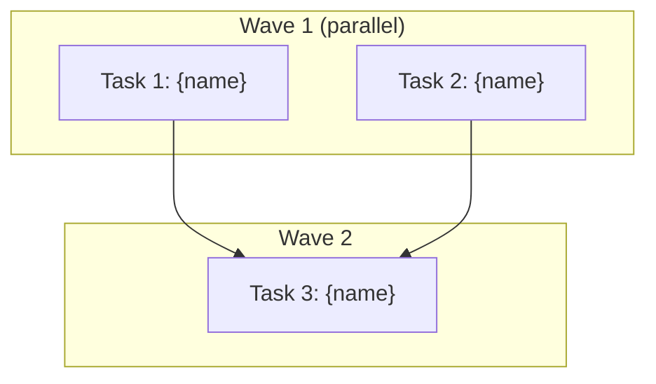

# Execute Plan Workflow

<purpose>
Execute a phase prompt (PLAN.md) and create the outcome summary (SUMMARY.md).
</purpose>

<required_reading>
Read STATE.md before any operation to load project context.
Read CONTEXT.md for brain-generated constraints and diagnostic state.
Read config.json for planning behavior settings.

@references/git-integration.md
</required_reading>

<process>

<step name="init_context" priority="first">
Load execution context:

```bash
INIT=$(node "nr-tools.cjs" init execute-phase "${PHASE}")
if [[ "$INIT" == @file:* ]]; then INIT=$(cat "${INIT#@file:}"); fi
```

Extract from init JSON: `executor_model`, `commit_docs`, `phase_dir`, `phase_number`, `plans`, `summaries`, `incomplete_plans`, `state_path`, `config_path`.

If `.planning/` missing: abort with "No Netrunner project found. Run /nr first."

Read CONTEXT.md for active constraints and hypothesis.
</step>

<step name="identify_plan">
Find next plan to execute:

```bash
ls .planning/phases/XX-name/*-PLAN.md 2>/dev/null | sort
ls .planning/phases/XX-name/*-SUMMARY.md 2>/dev/null | sort
```

Find first PLAN without matching SUMMARY. Decimal phases supported (`01.1-hotfix/`):

```bash
PHASE=$(echo "$PLAN_PATH" | grep -oE '[0-9]+(\.[0-9]+)?-[0-9]+')
```

Present plan identification, wait for confirmation if interactive mode.
</step>

<step name="load_brain_constraints">
Before executing, load the brain's constraint frame:

1. Read CONTEXT.md Hard Constraints
2. Read "What Has Been Tried" for closed paths
3. Read Decision Log for consistency
4. Read active hypothesis for alignment

Generate execution constraint frame:
```
CONSTRAINT FRAME:
MUST: [requirements from CONTEXT.md + PLAN.md must_haves]
MUST NOT: [hard constraints + closed paths]
PREFER: [brain's reasoning-informed preferences]
CONTEXT: [relevant prior outcomes from SUMMARY files]
```
</step>

<step name="parse_segments">
Read PLAN.md file. Parse frontmatter (YAML between `---`). Parse tasks from markdown.

Track: `PLAN_START_TIME`, `TASK_COUNT=0`, `TASK_COMMITS=()`.

| Task Type | Pattern | Who executes |
|-----------|---------|--------------|
| Autonomous | A (full plan) | Subagent: full plan + SUMMARY + commit |
| Verify-only | B (segmented) | Segments between checkpoints. After none/human-verify -> SUBAGENT. After decision/human-action -> MAIN |
| Decision | C (main) | Execute entirely in main context |
</step>

<step name="wave_team_dispatch">
## Wave-Based Team Dispatch

Group tasks from the plan into execution waves based on dependencies. Independent tasks go in the same wave; dependent tasks go in later waves.

**Generate wave structure diagram:** Before dispatching, emit a Mermaid `graph TD` showing the wave execution plan — tasks grouped by wave with dependency edges. Embed in the phase directory as part of execution tracking. Reference `references/visualization-patterns.md` for the Task Dependency Graph template.



### Single-Task Wave

If a wave has only 1 task, execute directly — no team overhead:

```
Task(subagent_type="nr-executor", description="Execute [task name]",
  prompt="Execute this task from Phase [N] plan.
TASK: [details from PLAN.md]
CONSTRAINT FRAME: [from load_brain_constraints step]
Commit each logical unit atomically.")
```

### Multi-Task Wave (Team-Based Parallel)

If a wave has 2+ independent tasks:

**1. Create wave team:**
```
TeamCreate(team_name="nr-exec-{phase}-{plan}-w{wave}", description="Wave {W}: {task_count} parallel tasks")
```

**2. Create tasks in shared list:**
```
For each TASK in wave:
  TaskCreate(subject="Execute: [task name]",
    description="[task details from PLAN.md]\nCONSTRAINT FRAME: [constraints, closed paths]\nCommit each logical unit atomically.",
    activeForm="Executing [task name]")
```

**3. Spawn one nr-executor per task (ALL in one turn for concurrency):**
```
For each TASK in wave:
  Agent(team_name="nr-exec-{phase}-{plan}-w{wave}", name="exec-task-{N}",
    subagent_type="nr-executor",
    prompt="You are a team member. Check TaskList, claim your task, execute it.
    TASK: [task details]
    CONSTRAINT FRAME: [constraints]
    Commit each logical unit atomically.
    Mark task completed when done.")
```

**4. Leader monitors TaskList** for all tasks completed. Collect commit hashes from outputs.

**5. Cleanup:**
```
SendMessage(type="shutdown_request", recipient="exec-task-{N}") for each member
TeamDelete()
```

**Sequential fallback:** If TeamCreate is unavailable or team spawning fails, execute each task in the wave sequentially using individual `Task()` calls.

### Wave Transition

After each wave completes:
- Verify all tasks succeeded via TaskList
- Failed tasks: one automatic retry (single `Task()` call), then spawn nr-debugger if still failing
- Record commit hashes: `TASK_COMMITS+=("Task ${TASK_NUM}: ${TASK_COMMIT}")`
- Proceed to next wave only when current wave is fully complete
</step>

<step name="execute_tasks">
For each task (within a wave, either direct or team-dispatched):

1. **Pre-generation gate** (from brain protocol):
   - Does this approach violate any Hard Constraint? -> STOP
   - Does this repeat a closed path? -> Find alternative
   - Is this specific to THIS project? -> Enhance if generic

2. **Execute the task** following PLAN.md instructions

3. **Verify done criteria** from the task

4. **Commit atomically** following git-integration.md:
   ```bash
   git add [specific files]
   git commit -m "{type}({phase}-{plan}): {task-name}

   - [Key change 1]
   - [Key change 2]
   "
   TASK_COMMIT=$(git rev-parse --short HEAD)
   TASK_COMMITS+=("Task ${TASK_NUM}: ${TASK_COMMIT}")
   ```

5. Check for untracked generated files -- commit or gitignore each one.
</step>

<step name="authentication_gates">
## Authentication Gates

External service tasks (API keys, OAuth, etc.): check `user_setup` in frontmatter.
If service needs setup and USER-SETUP.md shows "Incomplete": pause and present setup instructions.
</step>

<step name="deviation_rules">
## Deviation Rules

During execution, deviations from the plan may be necessary:

| Rule | Category | Action | Example |
|------|----------|--------|---------|
| 1 | Missing import | Auto-fix | Add missing import statement |
| 2 | Type error | Auto-fix | Fix type mismatch |
| 3 | Blocking error | Auto-fix | Install missing dependency |
| 4 | Missing critical | Auto-fix + document | Add security measure not in plan |
| 5 | Scope creep | STOP | Feature not in plan requirements |

**Auto-fix rules (1-4):** Fix immediately, document in SUMMARY deviations section.
**Scope boundary (5):** Do NOT implement. Note in SUMMARY for future planning.

## Documenting Deviations

Every auto-fix gets documented in SUMMARY.md:
- What was wrong
- What was done
- Why it was necessary
- Files modified
- Verification performed
</step>

<step name="tdd_execution">
## TDD Execution

For `type: tdd` plans:

1. **RED:** Write failing tests, commit with `test(...)` prefix
2. **GREEN:** Implement to pass tests, commit with `feat(...)` prefix
3. **REFACTOR:** Clean up, commit with `refactor(...)` prefix

Each TDD phase gets its own commit.
</step>

<step name="precommit_failure">
## Pre-commit Hook Failure Handling

If `git commit` fails due to pre-commit hooks:

1. Read the hook output
2. Fix the issue (formatting, linting, etc.)
3. Re-stage and commit
4. Document the fix as a deviation if significant
</step>

<step name="checkpoint_protocol">
On `type="checkpoint:*"`: automate everything possible first. Checkpoints are for verification/decisions only.

Display: `CHECKPOINT: [Type]` box with progress, task name, type-specific content, and required action.

| Type | Content | Resume signal |
|------|---------|---------------|
| human-verify (90%) | What was built + verification steps (commands/URLs) | "approved" or describe issues |
| decision (9%) | Decision needed + context + options with pros/cons | "Select: option-id" |
| human-action (1%) | What was automated + ONE manual step + verification plan | "done" |

After response: verify if specified. Pass -> continue. Fail -> inform, wait. WAIT for user -- do NOT hallucinate completion.
</step>

<step name="create_summary">
Create `{phase}-{plan}-SUMMARY.md` at `.planning/phases/XX-name/`. Use summary template.

**Frontmatter:** phase, plan, subsystem, tags | requires/provides/affects | tech-stack.added/patterns | key-files.created/modified | key-decisions | requirements-completed (**MUST** copy `requirements` array from PLAN.md frontmatter verbatim) | duration, completed date.

Title: `# Phase [X] Plan [Y]: [Name] Summary`

One-liner SUBSTANTIVE: "JWT auth with refresh rotation using jose library" not "Authentication implemented"

Include: duration, start/end times, task count, file count.

**Visualizations section:** Add a `## Visualizations Generated` section listing any Mermaid diagrams or Python plot scripts created during execution. Also generate a Mermaid `graph TD` artifact dependency graph showing what the plan created/modified and how artifacts connect. Reference `references/visualization-patterns.md`.
</step>

<step name="update_context">
After plan completion, update CONTEXT.md via brain reasoning:

1. Add approaches tried with outcomes to "What Has Been Tried"
2. Update hypothesis if new evidence emerged
3. Add any new constraints discovered
4. Update metrics if measurable change
5. Add to Decision Log if significant decisions were made
6. Add to Update Log
</step>

<step name="update_current_position">
Update STATE.md:

```bash
# Advance plan counter
node "nr-tools.cjs" state advance-plan

# Recalculate progress bar
node "nr-tools.cjs" state update-progress

# Record execution metrics
node "nr-tools.cjs" state record-metric \
  --phase "${PHASE}" --plan "${PLAN}" --duration "${DURATION}" \
  --tasks "${TASK_COUNT}" --files "${FILE_COUNT}"
```
</step>

<step name="extract_decisions_and_issues">
From SUMMARY: Extract decisions and add to STATE.md:

```bash
# Add each decision from SUMMARY key-decisions
node "nr-tools.cjs" state add-decision \
  --phase "${PHASE}" --summary-file "${DECISION_TEXT_FILE}" --rationale-file "${RATIONALE_FILE}"

# Add blockers if any found
node "nr-tools.cjs" state add-blocker --text-file "${BLOCKER_TEXT_FILE}"
```
</step>

<step name="update_session_continuity">
Update session info:

```bash
node "nr-tools.cjs" state record-session \
  --stopped-at "Completed ${PHASE}-${PLAN}-PLAN.md" \
  --resume-file "None"
```

Keep STATE.md under 150 lines.
</step>

<step name="issues_review_gate">
If SUMMARY "Issues Encountered" is not "None": log and continue (auto mode) or present issues and wait for acknowledgment (interactive mode).
</step>

<step name="update_roadmap">
```bash
node "nr-tools.cjs" roadmap update-plan "${PHASE}" "${PLAN}" --status complete
```
</step>

<step name="commit_planning_docs">
```bash
node "nr-tools.cjs" commit "docs(${PHASE}-${PLAN}): complete [plan-name] plan" \
  --files .planning/phases/XX-name/${PHASE}-${PLAN}-PLAN.md \
          .planning/phases/XX-name/${PHASE}-${PLAN}-SUMMARY.md \
          .planning/STATE.md \
          .planning/ROADMAP.md \
          .planning/CONTEXT.md
```
</step>

</process>

<task_commit>

## Task Commit Protocol

After each task (verification passed, done criteria met), commit immediately.

**1. Check:** `git status --short`

**2. Stage individually** (NEVER `git add .` or `git add -A`):
```bash
git add src/api/auth.ts
git add src/types/user.ts
```

**3. Commit type:**

| Type | When | Example |
|------|------|---------|
| `feat` | New functionality | feat(08-02): create user registration endpoint |
| `fix` | Bug fix | fix(08-02): correct email validation regex |
| `test` | Test-only (TDD RED) | test(08-02): add failing test for password hashing |
| `refactor` | Code cleanup | refactor(08-02): extract auth helpers |
| `perf` | Performance | perf(08-02): add database index |
| `docs` | Documentation | docs(08-02): add API docs |
| `chore` | Config/deps | chore(08-02): add bcrypt dependency |

**4. Format:** `{type}({phase}-{plan}): {description}` with bullet points for key changes.

**5. Record hash:**
```bash
TASK_COMMIT=$(git rev-parse --short HEAD)
TASK_COMMITS+=("Task ${TASK_NUM}: ${TASK_COMMIT}")
```

**6. Check for untracked generated files:**
```bash
git status --short | grep '^??'
```
If new untracked files appeared, decide for each:
- **Commit it** -- if it's a source file, config, or intentional artifact
- **Add to .gitignore** -- if it's a generated/runtime output
- Do NOT leave generated files untracked

</task_commit>
