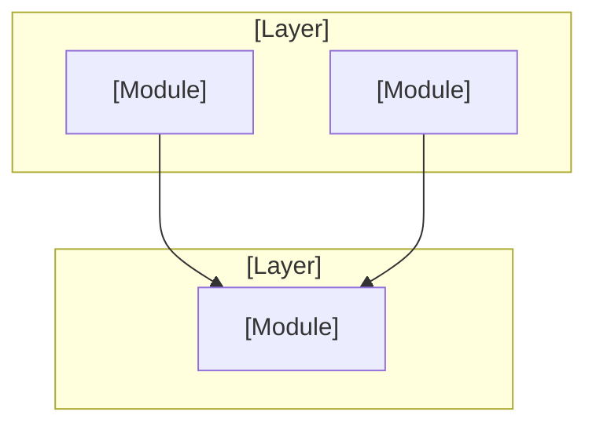

# Workflow: Map Codebase

<purpose>
Orchestrate parallel codebase mapper agents to analyze the codebase and produce structured documents in `.planning/codebase/`. Each agent has fresh context, explores a specific focus area, and writes documents directly. The orchestrator only receives confirmation, then writes a summary.
</purpose>

<inputs>
- Codebase root directory (current working directory)
- Optional: existing `.planning/codebase/` maps to refresh
</inputs>

<procedure>

## 1. Initialize

```bash
INIT=$(node ~/.claude/netrunner/bin/nr-tools.cjs init map-codebase 2>/dev/null)
if [[ "$INIT" == @file:* ]]; then INIT=$(cat "${INIT#@file:}"); fi
```

Extract from init JSON: `mapper_model`, `commit_docs`, `codebase_dir`, `existing_maps`, `has_maps`, `codebase_dir_exists`.

## 2. Check Existing Maps

If `.planning/codebase/` already exists:
- List existing documents
- Ask: "Codebase maps already exist. Refresh them or keep existing?"
- On refresh: proceed with re-mapping (overwrites existing)
- On keep: exit early

## 3. Create Output Directory

```bash
mkdir -p .planning/codebase
```

## 4. Spawn Mapper Agents (Team-Based Parallel)

Create a team and spawn 4 mapper agents concurrently, each with a distinct focus area.

### 4.1 Create Mapping Team

```
TeamCreate(team_name="nr-map-codebase", description="Parallel codebase mapping — 4 focus areas")
```

### 4.2 Create Tasks in Shared List

```
TaskCreate(subject="Map stack and integrations",
  description="Analyze technology stack and external integrations. Write STACK.md and INTEGRATIONS.md to .planning/codebase/.",
  activeForm="Mapping stack and integrations")

TaskCreate(subject="Map architecture and structure",
  description="Analyze architecture and directory structure. Write ARCHITECTURE.md and STRUCTURE.md to .planning/codebase/.",
  activeForm="Mapping architecture and structure")

TaskCreate(subject="Map conventions and testing",
  description="Analyze coding conventions and testing patterns. Write CONVENTIONS.md and TESTING.md to .planning/codebase/.",
  activeForm="Mapping conventions and testing")

TaskCreate(subject="Map concerns and technical debt",
  description="Analyze cross-cutting concerns and technical debt. Write CONCERNS.md to .planning/codebase/.",
  activeForm="Mapping concerns and technical debt")
```

### 4.3 Spawn All 4 Mappers (ONE turn for concurrency)

```
Agent(team_name="nr-map-codebase", name="mapper-stack", subagent_type="nr-mapper",
  prompt="You are a team member on nr-map-codebase. Check TaskList, claim 'Map stack and integrations'.

Focus: stack
Analyze this codebase's technology stack and external integrations.
Write these documents to .planning/codebase/:
- STACK.md -- Languages, runtime, frameworks, dependencies, configuration
- INTEGRATIONS.md -- External APIs, databases, auth providers, webhooks

Explore thoroughly. Write documents directly. Mark task completed when done.")

Agent(team_name="nr-map-codebase", name="mapper-arch", subagent_type="nr-mapper",
  prompt="You are a team member on nr-map-codebase. Check TaskList, claim 'Map architecture and structure'.

Focus: architecture
Analyze this codebase's architecture and directory structure.
Write these documents to .planning/codebase/:
- ARCHITECTURE.md -- Pattern (MVC, microservices, etc.), layers, data flow, abstractions, entry points
- STRUCTURE.md -- Directory layout, key locations, naming conventions, file organization

Explore thoroughly. Write documents directly. Mark task completed when done.")

Agent(team_name="nr-map-codebase", name="mapper-quality", subagent_type="nr-mapper",
  prompt="You are a team member on nr-map-codebase. Check TaskList, claim 'Map conventions and testing'.

Focus: quality
Analyze this codebase's coding conventions and testing patterns.
Write these documents to .planning/codebase/:
- CONVENTIONS.md -- Code style, naming patterns, error handling, common patterns
- TESTING.md -- Test framework, structure, mocking patterns, coverage, test utilities

Explore thoroughly. Write documents directly. Mark task completed when done.")

Agent(team_name="nr-map-codebase", name="mapper-concerns", subagent_type="nr-mapper",
  prompt="You are a team member on nr-map-codebase. Check TaskList, claim 'Map concerns and technical debt'.

Focus: concerns
Analyze this codebase for cross-cutting concerns and technical debt.
Write this document to .planning/codebase/:
- CONCERNS.md -- Security patterns, performance considerations, accessibility, tech debt, known issues, TODO/FIXME/HACK inventory

Explore thoroughly. Write document directly. Mark task completed when done.")
```

### 4.4 Cleanup Team

```
SendMessage(type="shutdown_request", recipient="mapper-stack")
SendMessage(type="shutdown_request", recipient="mapper-arch")
SendMessage(type="shutdown_request", recipient="mapper-quality")
SendMessage(type="shutdown_request", recipient="mapper-concerns")
TeamDelete()
```

**Sequential fallback:** If TeamCreate is unavailable or team spawning fails, execute each mapper focus sequentially using individual `Task()` calls with identical prompts. The workflow still works — just slower.

## 5. Collect Results

Leader checks TaskList for all 4 tasks completed, then verifies:

Expected 7 files in `.planning/codebase/`:
- STACK.md, INTEGRATIONS.md, ARCHITECTURE.md, STRUCTURE.md, CONVENTIONS.md, TESTING.md, CONCERNS.md

For each expected file:
- Verify file exists and is non-empty
- Note line counts for summary
- Log any issues

If a mapper agent fails:
- Re-spawn once with individual `Task()` call using same prompt
- If still fails, note the gap in summary

## 6. Write Summary

Create `.planning/codebase/SUMMARY.md`:

```markdown
# Codebase Map Summary

## Documents Generated
| Document | Lines | Focus |
|----------|-------|-------|
| STACK.md | [N] | Languages, frameworks, dependencies |
| INTEGRATIONS.md | [N] | External services, APIs, databases |
| ARCHITECTURE.md | [N] | Patterns, layers, data flow |
| STRUCTURE.md | [N] | Directory layout, organization |
| CONVENTIONS.md | [N] | Code style, patterns |
| TESTING.md | [N] | Test framework, coverage |
| CONCERNS.md | [N] | Tech debt, security, performance |

## Architecture Overview

{Generate a Mermaid `graph TD` synthesizing the top-level architecture from ARCHITECTURE.md. This is the visual entry point for understanding the codebase. Adapt to detected domain — reference `references/visualization-patterns.md`.}



## Key Findings
[Top 3-5 architectural observations from across all documents]

## Generated
[date]
```

## 7. Feed into CONTEXT.md

If `.planning/CONTEXT.md` exists:
- Add structural knowledge summary under a "Codebase" section
- Note key architectural patterns that inform constraint generation
- Update diagnostic state if architecture reveals relevant patterns

## 8. Commit (if configured)

```bash
git add .planning/codebase/
git commit -m "docs: map codebase structure and conventions"
```

</procedure>

<outputs>
- `.planning/codebase/STACK.md` -- technology stack and dependencies
- `.planning/codebase/INTEGRATIONS.md` -- external services and APIs
- `.planning/codebase/ARCHITECTURE.md` -- patterns, layers, data flow
- `.planning/codebase/STRUCTURE.md` -- directory layout and organization
- `.planning/codebase/CONVENTIONS.md` -- code style and patterns
- `.planning/codebase/TESTING.md` -- test framework and coverage
- `.planning/codebase/CONCERNS.md` -- tech debt, security, performance
- `.planning/codebase/SUMMARY.md` -- aggregated summary of all maps
</outputs>
