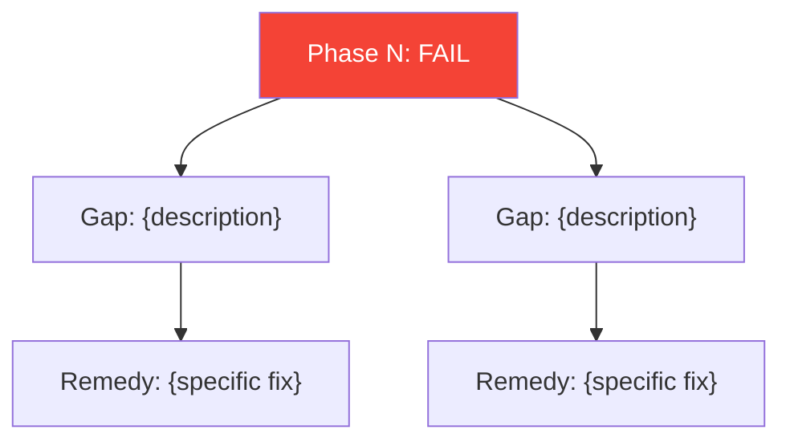

# Workflow: Verify Phase

<purpose>
Verify a completed phase against success criteria, constraint frame compliance, and diagnostic hypothesis alignment. Goes beyond checkbox verification -- the Brain assesses whether the phase's work actually advances the project toward its goal.
</purpose>

<inputs>
- Phase number to verify
- `.planning/phases/{NN}-{slug}/PLAN.md` -- what was supposed to happen
- `.planning/phases/{NN}-{slug}/SUMMARY.md` -- what actually happened
- `.planning/ROADMAP.md` -- success criteria for this phase
- `.planning/CONTEXT.md` -- constraints, diagnostic state, prior knowledge
- `.planning/REQUIREMENTS.md` -- requirements assigned to this phase
</inputs>

<procedure>

## 1. Initialize

```bash
PHASE_ARG="${PHASE_NUMBER}"
INIT=$(node ~/.claude/netrunner/bin/nr-tools.cjs init execute-phase "${PHASE_ARG}")
if [[ "$INIT" == @file:* ]]; then INIT=$(cat "${INIT#@file:}"); fi
```

**Validation:**
- Phase must exist and have SUMMARY.md. If not: "Phase [N] has no execution summary. Execute the phase first."
- CONTEXT.md must exist. Warn if missing, proceed with limited verification.

## 2. Load Phase Artifacts

Read all relevant files:
- `.planning/phases/{NN}-{slug}/PLAN.md` -- what was supposed to happen
- `.planning/phases/{NN}-{slug}/SUMMARY.md` -- what actually happened
- `.planning/ROADMAP.md` -- success criteria for this phase
- `.planning/CONTEXT.md` -- constraints, diagnostic state, prior knowledge
- `.planning/REQUIREMENTS.md` -- requirements assigned to this phase

## 3. Spawn Verifiers (Team-Based Parallel)

Split verification into 3 independent focus areas and run them concurrently.

### 3.1 Create Verification Team

```
TeamCreate(team_name="nr-verify-{phase}", description="Phase {N} verification — 3 parallel verifiers")
```

### 3.2 Create Verification Tasks

```
TaskCreate(subject="Verify: success criteria + requirements coverage",
  description="Document-driven verification. Check success criteria from ROADMAP.md and requirements coverage from REQUIREMENTS.md against SUMMARY.md. Write findings to .planning/phases/{NN}-{slug}/VERIFY-CRITERIA.md.",
  activeForm="Verifying success criteria and requirements")

TaskCreate(subject="Verify: E2E integration + test coverage",
  description="Code-driven verification. Check E2E integration with prior phases, API contract compliance, and test coverage for new functionality. Write findings to .planning/phases/{NN}-{slug}/VERIFY-INTEGRATION.md.",
  activeForm="Verifying integration and test coverage")

TaskCreate(subject="Verify: constraint compliance + hypothesis alignment",
  description="Brain-driven verification. Check hard constraint compliance from CONTEXT.md, hypothesis alignment, and closed path avoidance. Write findings to .planning/phases/{NN}-{slug}/VERIFY-BRAIN.md.",
  activeForm="Verifying constraint compliance")
```

### 3.3 Spawn 3 Verifiers (ONE turn for concurrency)

```
Agent(team_name="nr-verify-{phase}", name="verifier-criteria", subagent_type="nr-verifier",
  prompt="You are a team member on nr-verify-{phase}. Check TaskList, claim 'Verify: success criteria + requirements coverage'.

FOCUS: Document-driven verification (success criteria + requirements).

PHASE PLAN: [PLAN.md contents]
PHASE SUMMARY: [SUMMARY.md contents]
SUCCESS CRITERIA: [from ROADMAP.md]
REQUIREMENTS: [REQ-IDs and descriptions from REQUIREMENTS.md]

CHECK:
1. SUCCESS CRITERIA COMPLIANCE — For each criterion: Met? (YES/PARTIAL/NO) + Evidence
2. REQUIREMENTS COVERAGE — For each REQ-ID: Addressed? (COMPLETE/PARTIAL/NOT_ADDRESSED) + Evidence

Write findings to: .planning/phases/{NN}-{slug}/VERIFY-CRITERIA.md
Return: sub_verdict (PASS/PARTIAL/FAIL), gaps list, notes.
Mark task completed when done.")

Agent(team_name="nr-verify-{phase}", name="verifier-integration", subagent_type="nr-verifier",
  prompt="You are a team member on nr-verify-{phase}. Check TaskList, claim 'Verify: E2E integration + test coverage'.

FOCUS: Code-driven verification (integration + tests).

PHASE PLAN: [PLAN.md contents]
PHASE SUMMARY: [SUMMARY.md contents]

CHECK:
1. E2E INTEGRATION — Does this phase's output integrate correctly with prior phases? API contract violations? Data format mismatches?
2. TEST COVERAGE — Were tests written for new functionality? Do tests pass? Critical paths untested?

Write findings to: .planning/phases/{NN}-{slug}/VERIFY-INTEGRATION.md
Return: sub_verdict (PASS/PARTIAL/FAIL), gaps list, notes.
Mark task completed when done.")

Agent(team_name="nr-verify-{phase}", name="verifier-brain", subagent_type="nr-verifier",
  prompt="You are a team member on nr-verify-{phase}. Check TaskList, claim 'Verify: constraint compliance + hypothesis alignment'.

FOCUS: Brain-driven verification (constraints + hypothesis).

PHASE PLAN: [PLAN.md contents]
PHASE SUMMARY: [SUMMARY.md contents]
CONSTRAINT FRAME: [Active hard constraints from CONTEXT.md]
DIAGNOSTIC HYPOTHESIS: [Current hypothesis from CONTEXT.md]
WHAT HAS BEEN TRIED: [Closed paths from CONTEXT.md]

CHECK:
1. CONSTRAINT FRAME COMPLIANCE — For each constraint: Respected? (YES/VIOLATED) + Evidence
2. DIAGNOSTIC HYPOTHESIS ALIGNMENT — Does this phase support or invalidate hypothesis? New evidence? Should hypothesis be updated?

Write findings to: .planning/phases/{NN}-{slug}/VERIFY-BRAIN.md
Return: sub_verdict (PASS/PARTIAL/FAIL), gaps list, hypothesis_update suggestion.
Mark task completed when done.")
```

### 3.4 Merge Results

Leader collects all 3 sub-verdicts from TaskList and merges:

| Sub-verdicts | Overall Verdict |
|-------------|----------------|
| All PASS | **PASS** |
| Any PARTIAL, no FAIL | **PASS_WITH_NOTES** |
| Any FAIL | **FAIL** |

Merge into unified `VERIFICATION.md`:
- Combine gaps from all 3 verifiers
- Combine notes from all 3 verifiers
- Use hypothesis_update from verifier-brain
- Write to `.planning/phases/{NN}-{slug}/VERIFICATION.md`

### 3.5 Cleanup Team

```
SendMessage(type="shutdown_request", recipient="verifier-criteria")
SendMessage(type="shutdown_request", recipient="verifier-integration")
SendMessage(type="shutdown_request", recipient="verifier-brain")
TeamDelete()
```

**Sequential fallback:** If TeamCreate is unavailable or team spawning fails, execute all 3 verification checks sequentially using a single `Task()` call with the combined prompt below:

```
Task(
  subagent_type="nr-verifier",
  description="Verify Phase [N]: [name]",
  prompt="Verify Phase [N] completion comprehensively.
  [... all 6 checks: success criteria, constraints, hypothesis, E2E, tests, requirements ...]
  Write VERIFICATION.md to: [phase_dir]/VERIFICATION.md"
)
```

## 4. Process Verification Results

### On PASS:
- Log success to CONTEXT.md
- Mark requirements as Validated in REQUIREMENTS.md
- Proceed to phase transition

### On PASS_WITH_NOTES:
- Log notes to CONTEXT.md
- Mark requirements as Validated where applicable
- Display notes to user
- Proceed (notes are informational, not blocking)

### On FAIL:
- Brain reasons about fix strategy:

```
FAILURE ANALYSIS:
- Gaps found: [list from verifier]
- Root cause assessment: [brain's analysis]
- Fix strategy: [targeted fix | re-execute specific tasks | re-plan phase]
- Auto-fix possible? [yes/no]
```

**If auto-fix possible (one retry allowed):**
1. Spawn nr-executor with specific fix instructions
2. Re-run verification
3. If still failing: present to user

**If auto-fix not possible:**
Present options:
1. "Fix manually and re-verify" -- exit, user fixes, re-verifies later
2. "Accept with gaps" -- mark phase as PASS_WITH_NOTES, log gaps
3. "Re-plan this phase" -- trigger plan-phase workflow with gap context

## 5. Update CONTEXT.md

After verification (regardless of outcome):
- Log verification result and date
- Update diagnostic hypothesis if verifier suggested changes
- Add any new constraints discovered
- Record any new tried approaches

```bash
node ~/.claude/netrunner/bin/nr-tools.cjs brain add-update-log --phase N --change "Phase [N] verified: [PASS|FAIL]"
```

## 6. Write VERIFICATION.md

Ensure `.planning/phases/{NN}-{slug}/VERIFICATION.md` contains:

```markdown
# Phase [N] Verification

## Status: [PASS | PASS_WITH_NOTES | FAIL]
## Date: [date]

## Success Criteria
| Criterion | Status | Evidence |
|-----------|--------|----------|
| [criterion] | [MET/PARTIAL/NOT_MET] | [evidence] |

## Constraint Compliance
| Constraint | Status | Notes |
|------------|--------|-------|
| [constraint] | [RESPECTED/VIOLATED] | [notes] |

## Requirements Coverage
| REQ-ID | Status | Evidence |
|--------|--------|----------|
| [REQ-XX] | [COMPLETE/PARTIAL] | [evidence] |

## Integration Assessment
[E2E integration findings]

## Test Coverage
[Test coverage findings]

## Hypothesis Impact
[How this phase affects the diagnostic hypothesis]

## Verification Summary

{Generate Mermaid visualizations showing verification results:}


{If FAIL — also generate gap-to-remedy diagram:}



{Reference `references/visualization-patterns.md` for templates.}

## Gaps (if any)
[Specific gaps that need attention]
```

## 7. Acceptance Test Handoff

After verification completes with PASS or PASS_WITH_NOTES, check if acceptance testing should run:

1. **Check for STORIES.md** — does `.planning/STORIES.md` exist?
2. **If yes**, check Story-Phase Mapping: are any stories newly testable after this phase?
3. **If testable stories exist**, signal to the chain loop that ACCEPT_TEST should run next.
4. **If no testable stories** (or no STORIES.md), proceed directly to TRANSITION.

This handoff ensures that code-level verification (this workflow) and user-level acceptance testing (acceptance-test.md workflow) run in sequence — code correctness first, then user experience.

The VERIFICATION.md should note:
```markdown
## Acceptance Test Readiness
Stories newly testable after this phase: [STORY-XX, STORY-YY] or "None"
Acceptance testing: [PENDING | SKIPPED — no testable stories]
```

## 8. Commit

```bash
git add .planning/phases/${PADDED_PHASE}-*/VERIFICATION.md .planning/CONTEXT.md
git commit -m "verify(phase-${PHASE}): ${STATUS} - ${PHASE_NAME}"
```

</procedure>

<outputs>
- `.planning/phases/{NN}-{slug}/VERIFICATION.md` -- detailed verification results
- Updated `.planning/CONTEXT.md` -- verification findings logged
- Updated `.planning/REQUIREMENTS.md` -- requirements marked as Validated (on PASS)
</outputs>
